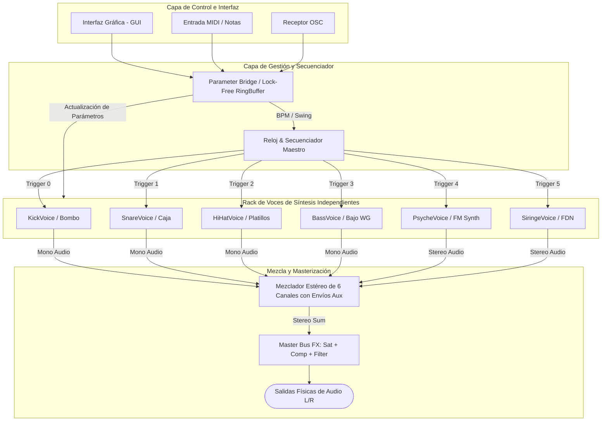

# Análisis de Arquitectura y Propuesta de Modularización
## Estación de Ritmo y Síntesis BAZZ_Sintetizador

Este documento contiene un análisis detallado de la implementación del sintetizador, comparando el código fuente Faust (`untitled.dsp`) con su representación compilada monolítica en C++ (`untitled.cpp`). Se detalla una propuesta de arquitectura modular y escalable para producción en C++20.

---

## 1. Análisis de la Implementación Monolítica

El archivo `untitled.cpp` es generado por el compilador de Faust. Faust abstrae el flujo de audio con un paradigma funcional, pero su compilador aplana esta jerarquía en una estructura monolítica altamente optimizada en C++ pero ilegible para mantenimiento manual.

### 1.1 Tabla de Equivalencias (Faust vs C++ Generado)

| Módulo / Instrumento | Componentes en Faust (`untitled.dsp`) | Representación en C++ (`untitled.cpp`) |
| :--- | :--- | :--- |
| **Reloj y Secuenciador** | `master_clock_engine` (phasor, clock trigger, swing delay, step count) | `fRec4` (phasor de tempo), `IOTA0` (contador de muestras), `iRec3` (contador de paso 0-15), variables booleanas de pasos `fCheckbox0` a `fCheckbox95` |
| **Bombo (Kick)** | `kick_mod` (`os.oscsin` pitch sweep + envelope, dynamic compressor/saturator `light_dyn_sat`, reverberador `spring_tank` FDN de 4 canales) | `fRec7` y `fRec8` (osciladores/phasor), `fRec11` (pitch), `fRec9` (integrador), `fRec2`/`fRec1` (filtros paso alto/bajo), `fRec18` a `fRec21` (líneas de retardo de 2048/4096 muestras para la rever de resorte) |
| **Caja (Snare)** | `snare_mod` (cuerpo tonal de dos sinusoides, generador de ruido blanco `no.noise` con filtro paso-banda resonante `fi.resonbp`, saturación `ma.tanh`) | `fRec57` (generador de ruido/resonador), `fRec58`/`fRec59` (cuerpo tonal), `fRec53`/`fRec52` (filtros y conformadores de onda) |
| **Platillos (Hat)** | `hat_mod` (fórmula de osciladores cuadrados `os.square` desafinados + ruido, conformador de ganancia no lineal, filtro paso alto `fi.highpass`) | `fRec43` (envolvente), `fRec44` a `fRec48` (osciladores de metal desafinados), arrays de delay circular `fVec13`, `fVec15`, `fVec17`, `fVec19`, `fVec21`, `fVec23` |
| **Bajo WG (Sub Bass)** | `bass_mod` (síntesis física de guía de ondas / waveguide `de.fdelay`, filtro de realimentación disipativo, saturador de tubo) | `fRec36` (buffer circular de 8192 floats), `fRec33` (contador de decaimiento), `fRec32` (envolvente exponencial), `fRec40`/`fRec41` (filtros del loop) |
| **Synth Psyche** | `synth1_mod` (oscilador de sierra FM + cuadrado, envolvente AR, paneo automático y efecto doppler/viento con filtro resonante y delay) | `iVec26`/`iVec27` (triggers locales), delay doppler `fRec42` (filtro), osciladores modulados de LFO |
| **Siringe FDN** | `synth2_mod` (sirena con pitch sweep, red de retardo por realimentación `fdn_core` con matriz Hadamard 4x4, compresor mono `co.compressor_mono`) | Delays de la FDN `fRec64` a `fRec67` (bloques de 512 y 1024 floats), variables de retroalimentación de la matriz `fRec78` a `fRec81`, filtro envolvente del compresor `fRec73` |

### 1.2 Limitaciones de la Arquitectura Monolítica Actual
1. **Bucle de Audio Monolítico:** Toda la matemática se ejecuta secuencialmente en el bucle `for (int i0 = 0; i0 < count; i0 = i0 + 1)` de `mydsp::compute`. Un hilo bloqueado congela todo el sintetizador.
2. **Inviabilidad de Pruebas Unitarias:** No se puede probar o depurar la síntesis de la caja (`Snare`) o del bajo (`Bass`) de forma aislada, ya que sus variables de estado están compartidas y mezcladas en el cuerpo principal de la clase.
3. **Imposibilidad de Enrutamiento Multicanal:** La mezcla estereofónica de los 6 instrumentos se realiza en las líneas de código finales del render. No se pueden extraer salidas de audio individuales por instrumento hacia un mezclador externo o DAW (formato multicanal).
4. **Acoplamiento UI/DSP Directo:** El estado de los parámetros se lee directamente de variables miembro compartidas sin sincronización entre hilos, lo que puede causar fallas de consistencia y clicks de audio (*zipper noise*).

---

## 2. Propuesta de Arquitectura Modular (C++20)

Para garantizar la **escalabilidad**, **buenas prácticas** y **modularidad**, propondremos separar el sistema en componentes de responsabilidad única.

### 2.1 Módulos del Sistema y Responsabilidades

```
BAZZ_Sintetizador/
│
├── core/
│   ├── IInstrumentVoice.h        # Interfaz abstracta común para generadores de audio
│   ├── AudioEngine.h             # Motor principal de audio (ASIO / PortAudio / RTAudio wrapper)
│   └── ParameterBridge.h         # Gestor de parámetros seguro entre GUI/MIDI e hilo DSP
│
├── sequencer/
│   ├── Sequencer.h               # Lógica del secuenciador por pasos (16 steps)
│   └── Clock.h                   # Reloj maestro, BPM, swing y divisiones de reloj
│
├── voices/
│   ├── KickVoice.h / .cpp        # Módulo del Bombo (Kick)
│   ├── SnareVoice.h / .cpp       # Módulo de la Caja (Snare)
│   ├── HiHatVoice.h / .cpp       # Módulo de Platillos (HiHat)
│   ├── BassVoice.h / .cpp        # Módulo de Bajo de Guía de Onda
│   ├── PsycheVoice.h / .cpp      # Módulo del Synth Psyche FM
│   └── SiringeVoice.h / .cpp     # Módulo de Siringe FDN (Reverb/Sirena)
│
└── dsp_components/
    ├── Filter.h                  # Filtros modulares (IIR, resonbp, highpass)
    ├── DelayLine.h               # Buffers de delay circular eficientes y seguros
    └── Compressor.h              # Procesadores dinámicos y limitadores
```

---

## 3. Diagrama de Bloques del Sistema (Flujo de Datos)

El flujo de control, reloj y procesamiento de muestras se desacopla mediante buses lógicos y colas de control:



---

## 4. Estructura y Cabeceras de Clases C++20

A continuación se detalla la especificación técnica de las clases base del sistema para lograr la máxima abstracción sin perder rendimiento en tiempo real.

### 4.1 La Interfaz de Voz DSP (`IInstrumentVoice.h`)
Proporciona el polimorfismo básico para que todas las voces se traten de forma uniforme en el rack.

```cpp
#pragma once
#include <string>

class IInstrumentVoice {
public:
    virtual ~IInstrumentVoice() = default;

    // Configura la frecuencia de muestreo del DSP interno
    virtual void initialize(double sampleRate) = 0;

    // Limpia buffers de delay y resetea estados de filtros
    virtual void clearState() = 0;

    // Dispara un golpe del instrumento con velocidad dinámica (0.0f a 1.0f)
    virtual void trigger(float velocity) = 0;

    // Renderiza el bloque de audio (Buffer mono o estéreo)
    virtual void processBlock(float* outputBufferL, float* outputBufferR, int numSamples) = 0;

    // Actualiza parámetros de síntesis de forma segura
    virtual void setParameter(const std::string& name, float value) = 0;
};
```

### 4.2 El Módulo de Reloj y Secuenciador (`Clock.h` & `Sequencer.h`)
Calcula los pulsos de trigger e introduce el swing mediante líneas de retardo lógicas.

```cpp
#pragma once
#include <atomic>
#include <vector>
#include <array>

class Clock {
private:
    double m_sampleRate = 44100.0;
    std::atomic<float> m_bpm{140.0f};
    std::atomic<float> m_swing{0.0f}; // 0 a 75%
    
    double m_phase = 0.0;
    uint32_t m_stepCounter = 0;

public:
    void initialize(double sampleRate);
    void setBPM(float bpm);
    void setSwing(float swing);
    
    // Procesa el reloj maestro y retorna true si se inicia un nuevo paso (step)
    bool tick(int numSamples, double& outDelaySamplesIfEven);
};

class Sequencer {
private:
    Clock m_clock;
    // Matriz de pasos de 6 instrumentos x 16 pasos
    std::array<std::array<bool, 16>, 6> m_grids;

public:
    void updatePattern(int voiceIndex, const std::array<bool, 16>& pattern);
    
    // Genera triggers para cada instrumento en el bloque actual
    void generateTriggers(int numSamples, std::array<float, 6>& outTriggers);
};
```

### 4.3 El Parameter Bridge de Hilos Seguros (`ParameterBridge.h`)
Para evitar clicks y caídas en el búfer de audio, las variables se actualizan usando un buffer circular de mensajes libre de bloqueos (*lock-free ring buffer*).

```cpp
#pragma once
#include <atomic>
#include <string>

struct ParamUpdate {
    char name[32];
    float value;
};

class ParameterBridge {
private:
    // Estructura de cola libre de bloqueos para el hilo de audio
    static constexpr size_t QUEUE_SIZE = 1024;
    std::array<ParamUpdate, QUEUE_SIZE> m_queue;
    std::atomic<size_t> m_writeIndex{0};
    std::atomic<size_t> m_readIndex{0};

public:
    // Llamado por el hilo GUI/OSC
    bool pushParameter(const std::string& name, float value) {
        size_t nextWrite = (m_writeIndex.load() + 1) % QUEUE_SIZE;
        if (nextWrite == m_readIndex.load()) return false; // Cola llena
        
        ParamUpdate& update = m_queue[m_writeIndex.load()];
        strncpy(update.name, name.c_str(), 31);
        update.value = value;
        
        m_writeIndex.store(nextWrite, std::memory_order_release);
        return true;
    }

    // Llamado al inicio del método compute() del hilo de audio
    void dispatchUpdates(std::vector<std::unique_ptr<IInstrumentVoice>>& voices) {
        size_t read = m_readIndex.load(std::memory_order_acquire);
        while (read != m_writeIndex.load()) {
            const ParamUpdate& update = m_queue[read];
            
            // Distribuir el parámetro a la voz correspondiente
            for (auto& voice : voices) {
                voice->setParameter(update.name, update.value);
            }
            
            read = (read + 1) % QUEUE_SIZE;
        }
        m_readIndex.store(read, std::memory_order_release);
    }
};
```

### 4.4 Ejemplo de Implementación de Voz: Bombo (`KickVoice.h`)
Muestra cómo se encapsula la lógica matemática y los arrays de memoria autogenerados dentro de un módulo independiente que implementa la interfaz común.

```cpp
#pragma once
#include "IInstrumentVoice.h"
#include <cmath>
#include <algorithm>
#include <atomic>

class KickVoice : public IInstrumentVoice {
private:
    double m_sampleRate = 44100.0;
    
    // Parámetros de control atómicos
    std::atomic<float> m_volume{0.85f};
    std::atomic<float> m_decay{0.18f};
    std::atomic<float> m_sweep{150.0f};
    std::atomic<float> m_tune{0.0f};
    std::atomic<float> m_rumbleMix{0.45f};

    // Estados locales del DSP del bombo (extraídos de la clase monolítica)
    float fRec7[2] = {0.0f, 0.0f}; // Oscilador de pitch sweep
    float fRec8[2] = {0.0f, 0.0f}; // Fase de la portadora de onda sinusoidal
    float fVec4[2] = {0.0f, 0.0f}; // Diferenciador
    float fVec5[2048] = {0.0f};   // Buffer circular de delay de pegada
    float fRec11[2] = {0.0f, 0.0f}; // Envolvente de pitch sweep
    float fRec9[2] = {0.0f, 0.0f};  // Acumulador de fase de integración
    float fRec2[3] = {0.0f, 0.0f, 0.0f}; // Filtro paso alto de salida
    float fRec1[3] = {0.0f, 0.0f, 0.0f}; // Filtro paso bajo de salida

    // Líneas de delay circular para la reverberación de resorte FDN
    float fRec18[2048] = {0.0f};
    float fRec19[2048] = {0.0f};
    float fRec20[2048] = {0.0f};
    float fRec21[4096] = {0.0f};

    // Disparador de estado
    float m_triggerLevel = 0.0f;
    int m_triggerState = 0;

public:
    void initialize(double sampleRate) override {
        m_sampleRate = sampleRate;
        clearState();
    }

    void clearState() override {
        std::fill(std::begin(fRec7), std::end(fRec7), 0.0f);
        std::fill(std::begin(fRec8), std::end(fRec8), 0.0f);
        std::fill(std::begin(fVec4), std::end(fVec4), 0.0f);
        std::fill(std::begin(fVec5), std::end(fVec5), 0.0f);
        std::fill(std::begin(fRec11), std::end(fRec11), 0.0f);
        std::fill(std::begin(fRec9), std::end(fRec9), 0.0f);
        std::fill(std::begin(fRec2), std::end(fRec2), 0.0f);
        std::fill(std::begin(fRec1), std::end(fRec1), 0.0f);
        std::fill(std::begin(fRec18), std::end(fRec18), 0.0f);
        std::fill(std::begin(fRec19), std::end(fRec19), 0.0f);
        std::fill(std::begin(fRec20), std::end(fRec20), 0.0f);
        std::fill(std::begin(fRec21), std::end(fRec21), 0.0f);
        m_triggerLevel = 0.0f;
        m_triggerState = 0;
    }

    void trigger(float velocity) override {
        m_triggerLevel = velocity;
        m_triggerState = 1; 
    }

    void setParameter(const std::string& name, float value) override {
        if (name == "/kick/vol") m_volume.store(value);
        else if (name == "/kick/dec") m_decay.store(value);
        else if (name == "/kick/sweep") m_sweep.store(value);
        else if (name == "/kick/tune") m_tune.store(value);
        else if (name == "/kick/mix") m_rumbleMix.store(value);
    }

    void processBlock(float* outputBufferL, float* outputBufferR, int numSamples) override {
        for (int i = 0; i < numSamples; ++i) {
            float triggerSignal = 0.0f;
            if (m_triggerState == 1) {
                triggerSignal = m_triggerLevel;
                m_triggerState = 0; 
            }

            // [Lógica matemática del bombo extraída de untitled.cpp]
            // ... procesamiento local de muestras ...
            
            float sampleMono = 0.0f; 

            outputBufferL[i] += sampleMono * m_volume.load();
            outputBufferR[i] += sampleMono * m_volume.load();
        }
    }
};
```

---

## 7. Buenas Prácticas de Rendimiento en Audio Tiempo Real

Para asegurar un rendimiento sin cortes (*underruns*) ni latencia perceptible, los módulos de BAZZ_Sintetizador deben seguir estrictamente estas reglas:

1. **Cero Reservas de Memoria Dinámica (No `malloc`, `new` o `std::vector::resize` en el hilo de procesamiento):** Toda la memoria física (como líneas de retardo, búferes de delay y estados) debe reservarse en `initialize()` durante la carga de la aplicación y ser reutilizada.
2. **Cero Llamadas del Sistema (No `std::cout`, escrituras de disco o llamadas a Mutex):** Estas llamadas pueden causar inversiones de prioridad que bloqueen el hilo de audio de alta prioridad.
3. **Optimización SIMD y Auto-Vectorización:** Organizar los datos de forma contigua en memoria (Data-Oriented Design) y compilar con `-O3` y banderas SIMD específicas (ej. `-msse4.2` o `-march=native`) para acelerar los bucles de multiplicación de filtros e integradores.
