# BAZZ Algorithmic Techno Station — Documentación Técnica de Arquitectura

## AUTOR: Santiago Alexander Zambrano Chicunque 

> **FaustSynthServer** · Estación de ritmos algorítmica de baja latencia  
> Motor DSP en C++17 · Faust · RtAudio · liblo OSC · uWebSockets

---

## Índice

1. [Visión General del Sistema](#1-visión-general-del-sistema)
2. [Diagrama de Arquitectura Global](#2-diagrama-de-arquitectura-global)
3. [Módulo Core — Dominio del Sintetizador](#3-módulo-core--dominio-del-sintetizador)
4. [Motor DSP — Pipeline de Audio (Faust + RtAudio)](#4-motor-dsp--pipeline-de-audio-faust--rtaudio)
5. [Diseño del Buffer de Audio](#5-diseño-del-buffer-de-audio)
6. [Arquitectura Acústica del Sintetizador](#6-arquitectura-acústica-del-sintetizador)
7. [Sistema de Reloj Maestro (MasterClock)](#7-sistema-de-reloj-maestro-masterclock)
8. [Conexiones OSC — Protocolo y Rutas](#8-conexiones-osc--protocolo-y-rutas)
9. [Vista desde Raspberry Pi (Linux / ALSA)](#9-vista-desde-raspberry-pi-linux--alsa)
10. [Vista desde Windows (WASAPI)](#10-vista-desde-windows-wasapi)
11. [Sincronización de Hardware Externo (GPIO Clock Sync)](#11-sincronización-de-hardware-externo-gpio-clock-sync)
12. [Sistema de Estado — Presets y Automatización](#12-sistema-de-estado--presets-y-automatización)
13. [Flujo de Arranque Completo](#13-flujo-de-arranque-completo)
14. [Tablas de Parámetros](#14-tablas-de-parámetros)
15. [Dependencias y Compilación](#15-dependencias-y-compilación)

---

## 1. Visión General del Sistema

**FaustSynthServer** es un servidor de síntesis de audio en tiempo real, inspirado en la TR-808 de Roland, diseñado como una caja de ritmos algorítmica con síntesis procedural. El sistema está construido sobre tres pilares tecnológicos:

| Pilar | Tecnología | Función |
|---|---|---|
| **Síntesis DSP** | Faust → C++ transpilado | Motor de síntesis de audio |
| **E/S de Audio** | RtAudio (ALSA / WASAPI) | Interfaz con el hardware de audio |
| **Control Remoto** | liblo OSC + uWebSockets | Comunicación bidireccional en red |

El servidor puede ejecutarse en **modo headless** (sin interfaz gráfica) sobre una Raspberry Pi 4/5, actuando como un instrumento de hardware autónomo, o sobre Windows con WASAPI de ultra-baja latencia.

---

## 2. Diagrama de Arquitectura Global

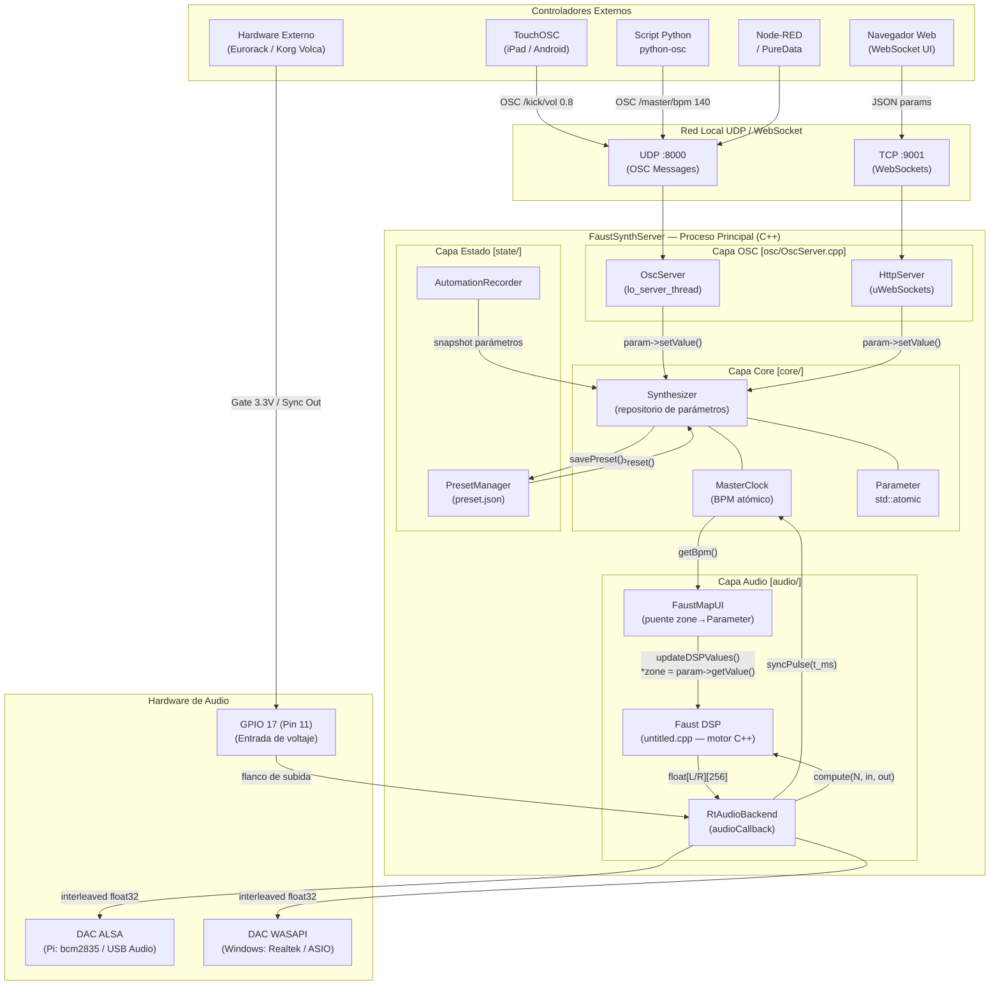

---

## 3. Módulo Core — Dominio del Sintetizador

### Diagrama de clases del Core

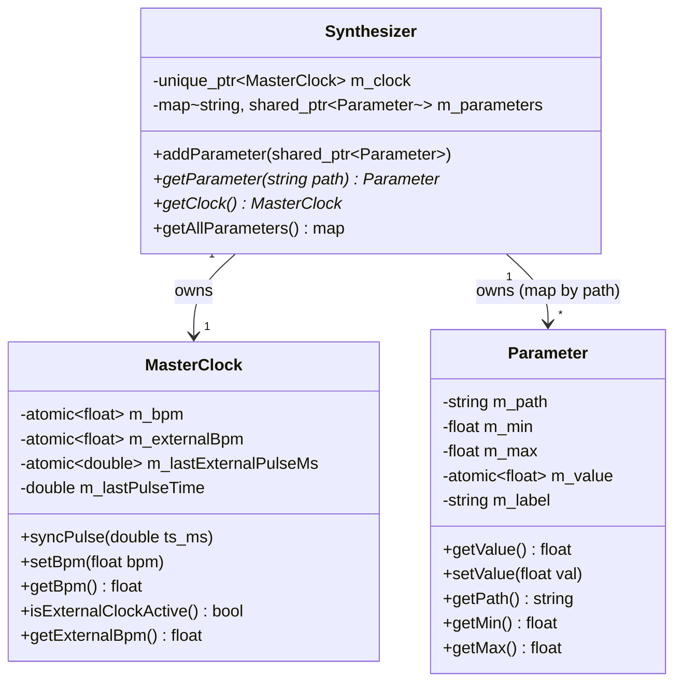

### Lógica lock-free de parámetros

El diseño garantiza **cero bloqueos** entre el hilo de audio (tiempo real) y los hilos de red (OSC / WebSocket):

```
Hilo OSC/WebSocket:              Hilo de Audio (RtAudio callback):
┌──────────────────┐             ┌──────────────────────────────┐
│ param->setValue()│             │ updateDSPValues():           │
│                  │             │   *zone = param->getValue()  │
│ m_value.store(v, │ ─ atómica ─▶│   m_value.load(             │
│  memory_order_   │             │    memory_order_acquire)     │
│  release)        │             │                              │
└──────────────────┘             └──────────────────────────────┘
```

**Garantías de memoria C++17:**
- `store(..., memory_order_release)` → toda escritura anterior queda visible
- `load(..., memory_order_acquire)` → toda lectura posterior ve los cambios

---

## 4. Motor DSP — Pipeline de Audio (Faust + RtAudio)

### Diagrama de flujo del callback de audio

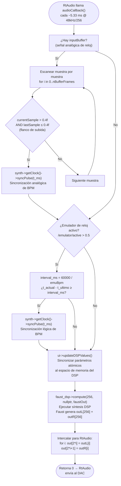

### Configuración de stream

| Parámetro | Valor | Justificación |
|---|---|---|
| **Sample Rate** | 48,000 Hz | Estándar profesional, compatible con Pi/USB |
| **Buffer Size** | 256 frames | ~5.33 ms de latencia, balance CPU/latencia |
| **Formato** | RTAUDIO_FLOAT32 | Precisión de 32 bits, rango ±1.0 normalizado |
| **Canales salida** | 2 (Stereo L/R) | Definido por Faust `getNumOutputs()` |
| **Canales entrada** | 1 (Mono) | Detección de voltaje de reloj analógico |
| **API Audio (Linux)** | ALSA (`__LINUX_ALSA__`) | Nativo del kernel, baja latencia |
| **API Audio (Windows)** | WASAPI (`__WINDOWS_WASAPI__`) | Ultra-baja latencia, exclusivo |

---

## 5. Diseño del Buffer de Audio

### Problema: Intercalado vs No-intercalado

RtAudio y Faust usan formatos de buffer opuestos. La solución implementa buffers intermedios estáticos:

```
Faust (no intercalado):          RtAudio (intercalado):
outL[] = [L0, L1, L2, ... L255]  out[] = [L0, R0, L1, R1, ... L255, R255]
outR[] = [R0, R1, R2, ... R255]
         ↓  conversión en callback  ↓
         for i in 0..255:
             out[2*i]   = outL[i]
             out[2*i+1] = outR[i]
```

### Memoria del buffer

```
outL[4096]  →  4096 × 4 bytes = 16 KB  (estático, evita heap allocation en RT)
outR[4096]  →  4096 × 4 bytes = 16 KB
faustOut[2] →  punteros a outL y outR
Total stack   →  ~32 KB por callback
```

> **Diseño de tiempo real**: Los buffers son `static` dentro del callback — nunca se usa `new`/`malloc` en el hilo de audio, cumpliendo las reglas de programación de tiempo real (RTAI/POSIX RT).

### Latencia total estimada

```
Latencia de buffer   = bufferFrames / sampleRate
                     = 256 / 48000
                     = 5.33 ms

Latencia total estimada (sistema):
  ┌─────────────────────────────────────┐
  │ Cómputo DSP Faust  ≈  1-2 ms       │
  │ Buffer RtAudio     ≈  5.33 ms      │
  │ Driver ALSA/WASAPI ≈  0.5-2 ms     │
  │ DAC hardware       ≈  0.1 ms       │
  │ ──────────────────────────────────  │
  │ TOTAL              ≈  7-10 ms      │
  └─────────────────────────────────────┘
```

---

## 6. Arquitectura Acústica del Sintetizador

El sintetizador implementa **6 voces de síntesis independientes**, cada una con su propio modelo acústico:

### Mapa de voces y técnicas de síntesis

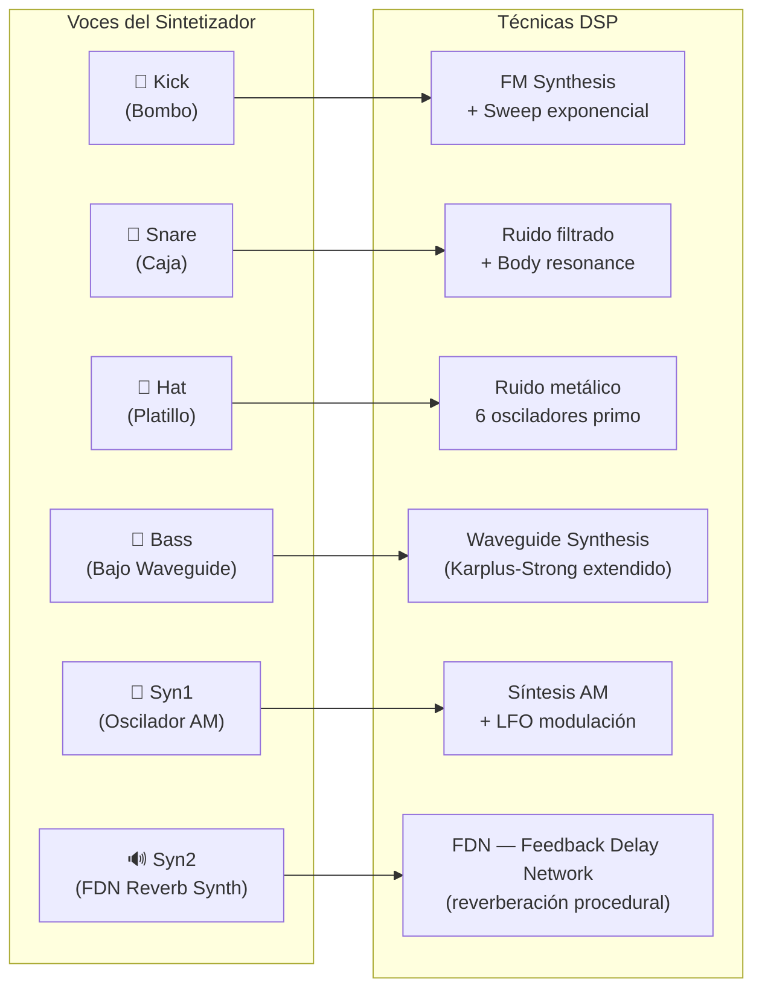

### Matemática de síntesis por voz

#### 🥁 Bombo (Kick) — FM + Sweep

```
Frecuencia instantánea:
  f(t) = f_tune + sweep × e^(-t / dec)

Donde:
  f_tune  = frecuencia base [Hz], controlada por /kick/tune
  sweep   = barrido de frecuencia [Hz], controlada por /kick/sweep
  dec     = tiempo de decaimiento [s], controlada por /kick/dec
  t       = tiempo desde el trigger [s]

Señal de salida:
  y(t) = A(t) × sin(2π ∫f(t)dt)

Envolvente de amplitud:
  A(t) = e^(-t / dec_amp)
```

#### 🥁 Caja (Snare) — Cuerpo + Resorte

```
Señal total:
  y(t) = mix × y_body(t) + (1-mix) × y_spring(t)

Cuerpo (resonador tonal):
  y_body(t) = sin(2π × f_body × t) × e^(-t / dec_cuerpo)

Resorte (ruido filtrado):
  y_spring(t) = BPF[f=freq, Q=q]( noise(t) ) × e^(-t / dec_resorte)
  BPF aplicado con HP adicional a f=hp para eliminar sub-graves
```

#### 🎸 Bajo Waveguide — Karplus-Strong Extendido

```
Síntesis por guía de onda digital:
  y[n] = 0.5 × (y[n-L] + y[n-L-1]) × decay_factor

Donde:
  L = round(sampleRate / f_nota)   (longitud del delay en muestras)
  f_nota = A4 × 2^((nota - 69) / 12)   (afinación MIDI → Hz)
  decay_factor = e^(-1 / (dec × sampleRate))

Detune (coro):
  Voz_1: L_1 = L
  Voz_2: L_2 = L × (1 + detune)
  Salida = Voz_1 + Voz_2 (stereo spread)
```

#### 🔊 Syn2 — FDN (Feedback Delay Network)

```
Red de delays con retroalimentación matricial:

  x[n] = input[n] + H × y[n-1]

Donde H es la matriz de Hadamard normalizada (N×N, N=4 o 8):
  H_4 = (1/2) × [[1,1,1,1],[1,-1,1,-1],[1,1,-1,-1],[1,-1,-1,1]]

Cada canal i tiene un delay L_i = disp × primo_i muestras
La densidad modal del FDN determina la calidad de reverberación.
```

---

## 7. Sistema de Reloj Maestro (MasterClock)

### Diagrama de flujo del MasterClock

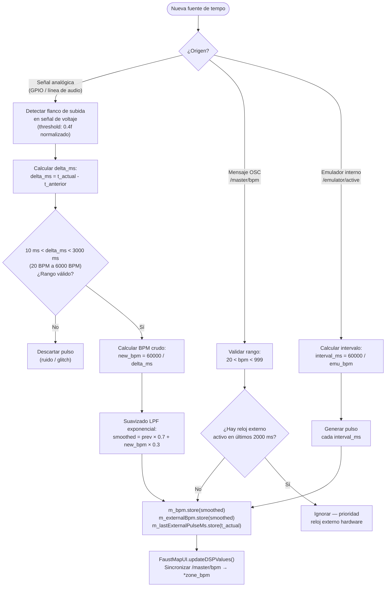

### Matemática del filtro de suavizado de BPM

El filtro de primer orden (IIR) aplicado al BPM detectado:

```
Función de transferencia (dominio Z):
  H(z) = α / (1 - (1-α)z⁻¹)

Con α = 0.3 (coeficiente de suavizado):
  BPM_suavizado[n] = 0.7 × BPM_suavizado[n-1] + 0.3 × BPM_crudo[n]

Respuesta al escalón (convergencia):
  Después de N muestras (pulsos):
  BPM_suavizado[N] = BPM_final × (1 - 0.7^N)

  N=5  pulsos → 83.2% convergencia
  N=10 pulsos → 97.2% convergencia
  N=20 pulsos → 99.9% convergencia

Tiempo de respuesta a 140 BPM (pulso cada 428 ms):
  5 pulsos × 428 ms ≈ 2.1 segundos para estabilizar al 83%
```

### Detección de reloj externo activo

```
isExternalClockActive():
  now_ms = steady_clock::now() [ms]
  return (now_ms - m_lastExternalPulseMs) < 2000.0

Ventana de timeout: 2 segundos
→ Si no llega pulso en 2s, se considera reloj perdido
→ OSC /master/bpm vuelve a tener efecto
```

---

## 8. Conexiones OSC — Protocolo y Rutas

### Diagrama de flujo del servidor OSC

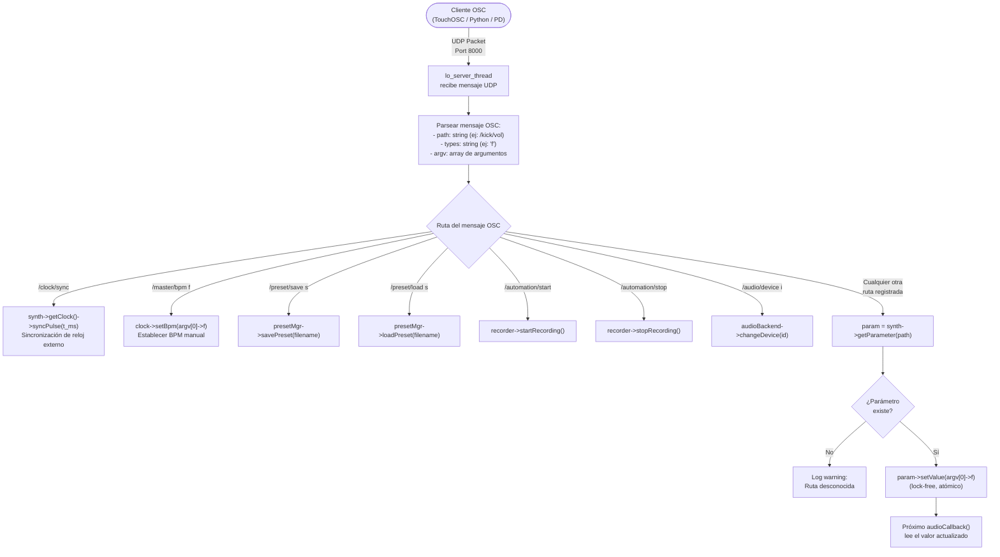

### Tabla completa de rutas OSC

#### Globales / Master

| Ruta OSC | Tipo | Rango | Descripción |
|---|---|---|---|
| `/master/bpm` | `f` | 20.0 – 999.0 | Tempo maestro en BPM |
| `/master/accent` | `f` | 0.0 – 1.0 | Acentuación global de patrones |
| `/master/nota` | `f` | 0 – 127 | Nota raíz MIDI del patrón |
| `/master/groove` | `f` | 0 – 6 | Selector de patrón algorítmico |
| `/clock/sync` | `(vacío)` | — | Pulso de reloj externo (BPM auto-detect) |

#### Bombo (Kick)

| Ruta OSC | Tipo | Rango | Descripción |
|---|---|---|---|
| `/kick/vol` | `f` | 0.0 – 1.0 | Volumen |
| `/kick/tune` | `f` | 0.0 – 1.0 | Afinación base |
| `/kick/dec` | `f` | 0.01 – 1.0 | Tiempo de decaimiento |
| `/kick/sweep` | `f` | 0 – 500 | Barrido de frecuencia (Hz) |
| `/kick/mix` | `f` | 0.0 – 1.0 | Mix body/tone |
| `/kick/comp_thresh` | `f` | 0.0 – 1.0 | Umbral del compresor interno |
| `/kick/comp_ratio` | `f` | 1.0 – 10.0 | Ratio de compresión |
| `/kick/groove` | `f` | 0 – 6 | Patrón rítmico del kick |
| `/kick/swing` | `f` | 0 – 100 | Swing / shuffle |

#### Caja (Snare)

| Ruta OSC | Tipo | Rango | Descripción |
|---|---|---|---|
| `/snare/vol` | `f` | 0.0 – 1.0 | Volumen |
| `/snare/dec_cuerpo` | `f` | 0.01 – 1.0 | Decay del cuerpo tonal |
| `/snare/dec_resorte` | `f` | 0.01 – 1.0 | Decay del resorte (ruido) |
| `/snare/freq` | `f` | 100 – 5000 | Frecuencia de resonancia cuerpo |
| `/snare/q` | `f` | 0.1 – 20.0 | Factor Q del filtro |
| `/snare/hp` | `f` | 20 – 500 | Highpass del ruido |
| `/snare/tune` | `f` | -24 – +24 | Afinación en semitonos |
| `/snare/drive` | `f` | 0.0 – 10.0 | Saturación / distorsión |

#### Platillo (Hat)

| Ruta OSC | Tipo | Rango | Descripción |
|---|---|---|---|
| `/hat/vol` | `f` | 0.0 – 1.0 | Volumen |
| `/hat/dec` | `f` | 0.001 – 2.0 | Decay |
| `/hat/tune` | `f` | -1.0 – 1.0 | Afinación del banco de osciladores |
| `/hat/cutoff` | `f` | 500 – 20000 | Frecuencia de corte del filtro |
| `/hat/mix` | `f` | 0.0 – 1.0 | Mix closed/open |
| `/hat/drive` | `f` | 0.0 – 1.0 | Saturación |

#### Bajo Waveguide (Bass)

| Ruta OSC | Tipo | Rango | Descripción |
|---|---|---|---|
| `/bass/vol` | `f` | 0.0 – 1.0 | Volumen |
| `/bass/nota` | `f` | 0 – 127 | Nota MIDI base |
| `/bass/dec` | `f` | 0.01 – 2.0 | Decaimiento del waveguide |
| `/bass/detune` | `f` | 0.0 – 0.5 | Detune para efecto coro |
| `/bass/intervalo` | `f` | -24 – +24 | Intervalo armónico |
| `/bass/drive` | `f` | 0.0 – 2.0 | Saturación armónica |
| `/bass/lfo` | `f` | 0.0 – 1.0 | Profundidad del LFO |

#### Sintetizador FDN (Syn2)

| Ruta OSC | Tipo | Rango | Descripción |
|---|---|---|---|
| `/syn2/vol` | `f` | 0.0 – 1.0 | Volumen |
| `/syn2/dec` | `f` | 0.001 – 2.0 | Decay del ataque |
| `/syn2/disp` | `f` | 0.0 – 1.0 | Dispersión modal del FDN |
| `/syn2/lfo_f` | `f` | 0.1 – 20.0 | Frecuencia del LFO |
| `/syn2/lfo_p` | `f` | 0.0 – 1.0 | Fase del LFO |
| `/syn2/comp_th` | `f` | -60 – 0 | Umbral del compresor (dBFS) |

#### Control del sistema

| Ruta OSC | Tipo | Descripción |
|---|---|---|
| `/preset/save` | `s` | Guardar preset a archivo |
| `/preset/load` | `s` | Cargar preset desde archivo |
| `/automation/start` | — | Iniciar grabación de automatización |
| `/automation/stop` | — | Detener grabación |
| `/audio/device` | `i` | Cambiar dispositivo de audio (ID entero) |
| `/emulator/active` | `f` | 0=off, 1=on — emulador de reloj interno |
| `/emulator/bpm` | `f` | BPM del emulador (60–240) |

---

## 9. Vista desde Raspberry Pi (Linux / ALSA)

### Diagrama de capas del sistema en Raspberry Pi

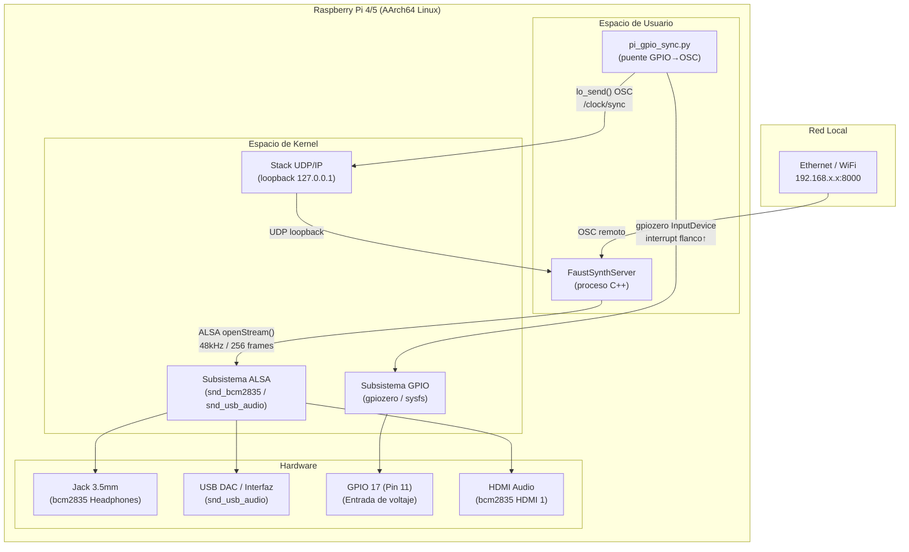

### Flags de compilación para Raspberry Pi 4

```cmake
# CMakeLists.txt — Sección Linux (AArch64)
-O3            # Optimización máxima del compilador
-ffast-math    # Aritmética de punto flotante relajada (IEEE 754 flexible)
-mcpu=cortex-a72   # Cortex-A72 = CPU del RPi 4 (1.5/1.8 GHz)
-mtune=cortex-a72  # Ajuste de scheduling a la microarquitectura
-mfpu=neon-fp-armv8  # Habilitar extensiones SIMD NEON (vectorización)
-ftree-vectorize     # Permitir auto-vectorización por el compilador
-funroll-loops       # Desenrollar loops (mejora throughput DSP)
```

**Impacto de -mcpu=cortex-a72 + NEON**: El compilador puede vectorizar bucles de audio procesando **4 muestras float32 en paralelo** por instrucción SIMD, cuadruplicando el throughput de cálculo.

### Configuración de servicio systemd (headless)

```
Arranque de la Raspberry Pi:
         │
         ▼
  systemd target: multi-user
         │
         ├─── synthesizer.service
         │         │
         │         └── FaustSynthServer [device_id]
         │                  │
         │                  ├── Carga preset.json
         │                  ├── Abre stream ALSA @ 48kHz/256
         │                  └── Escucha OSC :8000
         │
         └─── synthesizer-sync.service (requiere synthesizer.service)
                   │
                   └── pi_gpio_sync.py
                            │
                            ├── Monitoriza GPIO 17 (interrupts)
                            └── Envía /clock/sync por UDP loopback
```

### Dispositivos de audio ALSA disponibles

| ID | Dispositivo | Canales | Latencia típica | Recomendado para |
|---|---|---|---|---|
| `[0]` | bcm2835 HDMI 1 | Out: 2 | ~10 ms | Monitores por HDMI |
| `[1]` | Headphones (3.5mm) | Out: 2 | ~8 ms | Auriculares / mezcla |
| `[2]` | USB Audio Device | In/Out: 2 | ~5 ms | **Producción / DAW** |

---

## 10. Vista desde Windows (WASAPI)

### Diagrama de capas en Windows

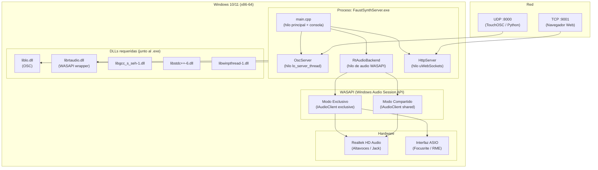

### Modelo de hilos en Windows

```
Proceso FaustSynthServer.exe
├── Hilo Principal (main thread)
│     • Bucle de comandos de consola (stdin)
│     • Carga/guarda preset.json
│     • Manejo de señales SIGINT/SIGTERM
│
├── Hilo de Audio (RtAudio / WASAPI interno)
│     • Prioridad: THREAD_PRIORITY_TIME_CRITICAL
│     • Callback cada 5.33 ms (256 frames @ 48kHz)
│     • Lee parámetros atómicos → ejecuta Faust DSP → envía a DAC
│
├── Hilo OSC (lo_server_thread)
│     • Escucha UDP :8000
│     • Parsea mensajes OSC
│     • Actualiza parámetros atómicos (lock-free)
│
└── Hilo WebSocket (uWebSockets + libuv)
      • Escucha TCP :9001
      • Sirve interfaz web HTML
      • Despacha eventos JSON → parámetros
```

### Flags de compilación Windows (MSYS2 / GCC)

```cmake
# Para MSYS2/GCC en Windows:
-O3 -ffast-math
# Definiciones para activar el backend WASAPI:
__WINDOWS_WASAPI__
# Definiciones para uWebSockets:
UWS_NO_ZLIB
LIBUS_USE_LIBUV
LIBUS_NO_SSL
```

### Comandos de consola disponibles

```
synth-server> list               → Listar dispositivos de audio WASAPI
synth-server> set <id>           → Cambiar dispositivo (hot-swap sin interrumpir audio)
synth-server> emu on             → Activar emulador de reloj interno
synth-server> emu off            → Desactivar emulador de reloj
synth-server> emu bpm <valor>    → Establecer tempo del emulador (ej: emu bpm 128.5)
synth-server> status             → Ver BPM activo, estado del emulador, dispositivo
synth-server> exit               → Guardar preset.json y salir limpiamente
```

---

## 11. Sincronización de Hardware Externo (GPIO Clock Sync)

### Diagrama completo de la cadena de sincronización analógica

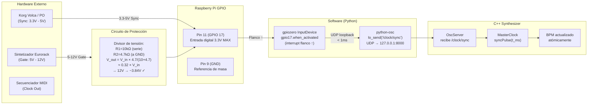

### Cálculo del divisor de tensión para protección GPIO

```
Divisor resistivo para señales Eurorack (hasta 12V):

        V_in ─── R1 (10kΩ) ─── V_out ─── R2 (4.7kΩ) ─── GND

Formula:
  V_out = V_in × R2 / (R1 + R2)
  V_out = V_in × 4700 / (10000 + 4700)
  V_out = V_in × 0.3197

Casos de uso:
  V_in = 5V  (Volca)   → V_out = 1.60V  ✓ (seguro)
  V_in = 8V  (Eurorack)→ V_out = 2.56V  ✓ (seguro)
  V_in = 12V (Eurorack)→ V_out = 3.84V  ⚠️ (ligeramente alto)

Para 12V se recomienda:
  R1 = 15kΩ, R2 = 4.7kΩ → V_out = 12 × 0.238 = 2.86V ✓

Umbral de detección en el software:
  currentSample > 0.4f  (normalizado: 0.4 × V_max_ADC)
  Con V_max = 3.3V → umbral físico ≈ 1.32V
```

### Latencia de la cadena de sincronización

```
Cadena completa de sincronización:

  Pulso físico de clock
        │
        │  ~0.1 ms  (tiempo de rise del gate)
        ▼
  Interrupción GPIO (gpiozero)
        │
        │  ~0.5 ms  (latencia del kernel Linux GPIO)
        ▼
  Callback Python when_activated()
        │
        │  ~0.2 ms  (construcción y envío del paquete OSC)
        ▼
  Stack UDP loopback (127.0.0.1)
        │
        │  ~0.1 ms  (loopback es prácticamente instantáneo)
        ▼
  OscServer.genericHandler()
        │
        │  ~0.05 ms (atomic store del nuevo BPM)
        ▼
  Próximo audioCallback() (RtAudio)
        │
        │  0 – 5.33 ms (espera al próximo buffer de 256 frames)
        ▼
  Faust DSP con BPM actualizado

  LATENCIA TOTAL: ~1 ms + 0-5.33 ms de jitter de buffer
  LATENCIA PERCIBIDA: < 6 ms (imperceptible musicalmente)
```

---

## 12. Sistema de Estado — Presets y Automatización

### Diagrama de flujo del PresetManager

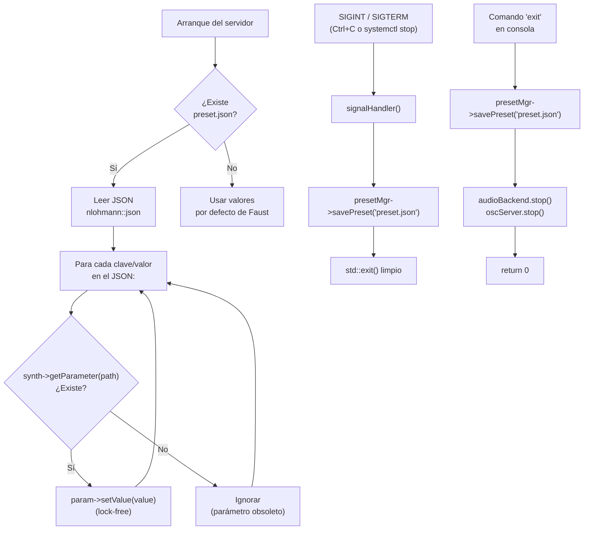

### Formato del preset.json

El archivo `preset.json` es un mapa plano de rutas OSC a valores float:

```json
{
  "/kick/vol": 0.114,
  "/kick/tune": 0.463,
  "/kick/dec": 0.07,
  "/master/bpm": 140.0,
  "/emulator/active": 0,
  "/emulator/bpm": 137.0,
  ...
}
```

Esto permite **interoperabilidad directa** con clientes OSC — los mismos paths que se usan en mensajes de red son los que se persisten en disco.

---

## 13. Flujo de Arranque Completo

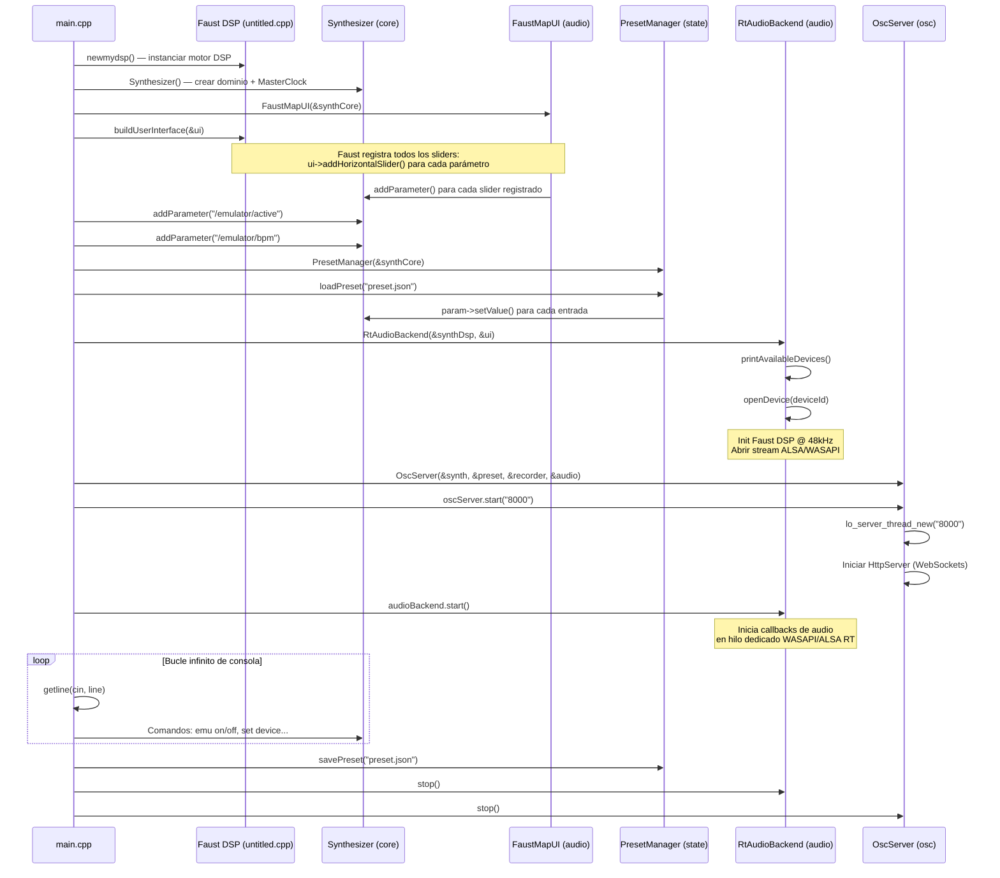

---

## 14. Tablas de Parámetros

### Preset de fábrica (valores iniciales)

| Instrumento | Parámetro | Valor Inicial | Rango |
|---|---|---|---|
| **Master** | `/master/bpm` | 140.0 | 20 – 999 |
| **Kick** | `/kick/vol` | 0.114 | 0 – 1 |
| **Kick** | `/kick/tune` | 0.463 | 0 – 1 |
| **Kick** | `/kick/dec` | 0.07 | 0.01 – 1 |
| **Kick** | `/kick/sweep` | 150 | 0 – 500 |
| **Kick** | `/kick/groove` | 2 | 0 – 6 |
| **Snare** | `/snare/vol` | 0.0 | 0 – 1 |
| **Snare** | `/snare/dec_cuerpo` | 0.07 | 0.01 – 1 |
| **Snare** | `/snare/dec_resorte` | 0.16 | 0.01 – 1 |
| **Snare** | `/snare/drive` | 3.51 | 0 – 10 |
| **Hat** | `/hat/vol` | 0.0 | 0 – 1 |
| **Hat** | `/hat/dec` | 0.15 | 0.001 – 2 |
| **Hat** | `/hat/cutoff` | 4754.86 Hz | 500 – 20k |
| **Bass** | `/bass/vol` | 0.0 | 0 – 1 |
| **Bass** | `/bass/dec` | 0.57 | 0.01 – 2 |
| **Bass** | `/bass/detune` | 0.04 | 0 – 0.5 |
| **Syn1** | `/syn1/vol` | 0.03 | 0 – 1 |
| **Syn2** | `/syn2/vol` | 0.22 | 0 – 1 |
| **Syn2** | `/syn2/comp_th` | -20 dBFS | -60 – 0 |
| **Emulador** | `/emulator/bpm` | 137.0 | 60 – 240 |

---

## 15. Dependencias y Compilación

### Grafo de dependencias

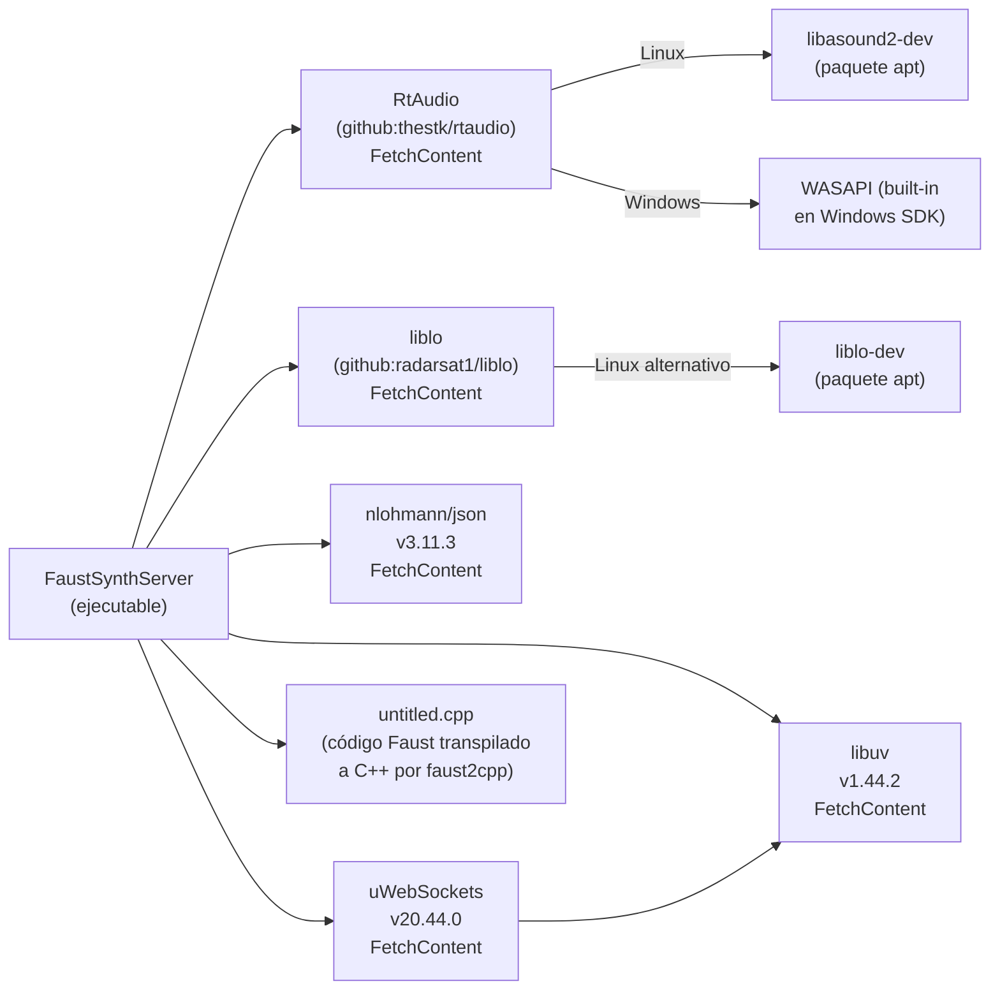

### Stack tecnológico completo

| Capa | Tecnología | Versión | Propósito |
|---|---|---|---|
| Lenguaje | C++17 | — | Core del servidor |
| DSP Source | Faust | 2.x | Diseño del sintetizador |
| DSP Runtime | C++ generado | — | Motor de síntesis (untitled.cpp) |
| Audio I/O | RtAudio | master | Abstracción ALSA/WASAPI |
| OSC | liblo | master | Protocolo Open Sound Control |
| JSON | nlohmann/json | 3.11.3 | Presets y estado |
| WebSocket | uWebSockets | 20.44.0 | Interfaz web en tiempo real |
| Async I/O | libuv | 1.44.2 | Event loop para uWebSockets |
| Build | CMake | ≥3.14 | Sistema de compilación |
| Linux Audio | ALSA | kernel | Backend nativo Linux |
| Windows Audio | WASAPI | Win 10+ | Backend nativo Windows |

### Quickstart — Raspberry Pi

```bash
# 1. Instalar dependencias
sudo apt update && sudo apt install -y build-essential cmake git libasound2-dev liblo-dev

# 2. Compilar
cd /home/pi/sintetizador
cmake -B build -S . -DCMAKE_BUILD_TYPE=Release
cmake --build build -j$(nproc)

# 3. Ejecutar (con salida por jack 3.5mm = dispositivo 1)
./build/FaustSynthServer 1

# 4. Instalar como servicio headless
sudo systemctl enable synthesizer.service && sudo systemctl start synthesizer.service
```

### Quickstart — Windows (MSYS2)

```powershell
# 1. Instalar herramientas (en terminal MSYS2 UCRT64)
pacman -S mingw-w64-ucrt-x86_64-gcc mingw-w64-ucrt-x86_64-cmake mingw-w64-ucrt-x86_64-ninja

# 2. Compilar (en PowerShell)
$env:PATH = "C:\msys64\ucrt64\bin;" + $env:PATH
cmake -B build -S . -G "Ninja"
cmake --build build --config Release

# 3. Ejecutar
.\build\FaustSynthServer.exe
```

---

> **Ver también:**
> - [GUIA_RASPBERRY.md](./GUIA_RASPBERRY.md) — Instalación detallada en Raspberry Pi, GPIO sync, y servicio headless
> - [GUIA_WINDOWS.md](./GUIA_WINDOWS.md) — Instalación en Windows con MSYS2 y WASAPI
> - [preset.json](./preset.json) — Configuración de parámetros persistida
> - [untitled.dsp](./untitled.dsp) — Código fuente Faust del motor de síntesis
