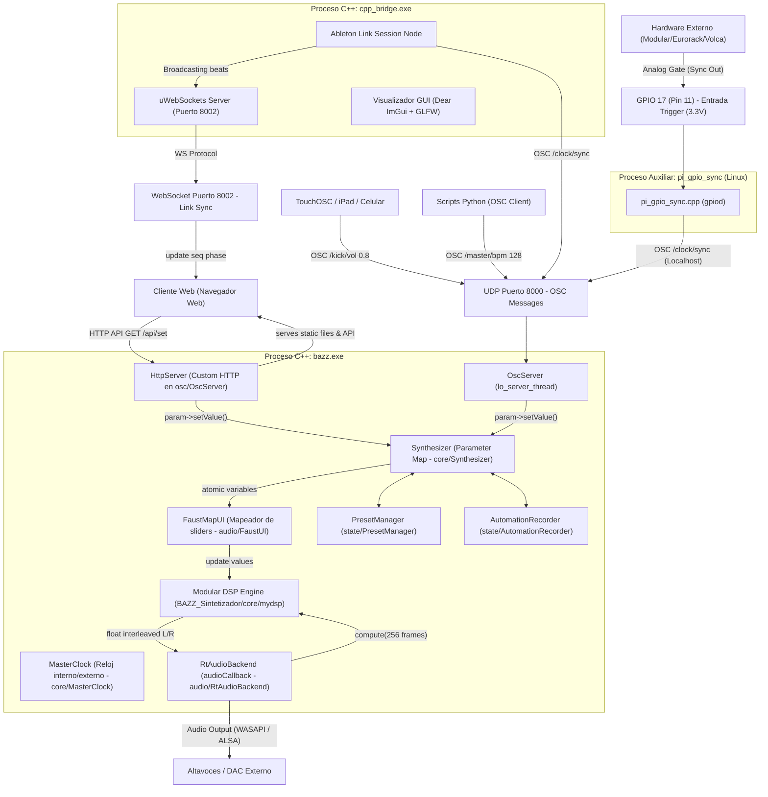

# BAZZ Algorithmic Techno Station — Estación de Ritmos y Síntesis de Baja Latencia

> **Bazz SynthServer** · Motor DSP modular en C++20 · Faust · RtAudio · Ableton Link · liblo OSC · uWebSockets · Web UI (DDD Architecture)

---

## Índice

1. [Visión General del Sistema](#1-visión-general-del-sistema)
2. [Arquitectura Global del Sistema](#2-arquitectura-global-del-sistema)
3. [Componentes del Proyecto](#3-componentes-del-proyecto)
4. [Prerrequisitos y Dependencias](#4-prerrequisitos-y-dependencias)
5. [Guía de Compilación](#5-guía-de-compilación)
6. [Guía de Ejecución y Puesta en Marcha](#6-guía-de-ejecución-y-puesta-en-marcha)
7. [Arquitectura del Cliente Web (Frontend DDD)](#7-arquitectura-del-cliente-web-frontend-ddd)
8. [Estructura del Repositorio](#8-estructura-del-repositorio)
9. [Referencia de Rutas y Parámetros OSC](#9-referencia-de-rutas-y-parámetros-osc)
10. [Sincronización GPIO y Hardware Externo (Linux/Raspberry Pi)](#10-sincronización-gpio-y-hardware-externo-linuxraspberry-pi)
11. [Despliegue en Segundo Plano y Arranque Automático (Autostart)](#11-despliegue-en-segundo-plano-y-arranque-automático-autostart)

---

## 1. Visión General del Sistema

**BAZZ** es una caja de ritmos algorítmica y servidor de síntesis procedural en tiempo real inspirado en la mítica Roland TR-808, diseñado para funcionar con una latencia ultra baja. 

El sistema consta de un motor de síntesis de audio escrito en C++20 que integra código DSP transpilado de Faust, un puente de sincronización basado en **Ableton Link** para tocar en red junto a otros dispositivos de software/hardware, y un secuenciador interactivo basado en navegador web desarrollado con arquitectura de Diseño Guiado por el Dominio (DDD).

### Pilares Tecnológicos

*   **Motor DSP (C++20 + Faust):** Síntesis procedural pura y modelado físico sin uso de muestras (samples), lo que permite control continuo y dinámico sobre cada aspecto del sonido.
*   **Audio I/O (RtAudio):** Capa de abstracción cross-platform para el driver de audio de baja latencia: **WASAPI** en Windows y **ALSA** en Linux.
*   **Control Remoto y API (liblo + Custom HTTP Server):** Un hilo servidor que procesa mensajes UDP bajo el protocolo OSC (Open Sound Control) en el puerto `8000`, y sirve el cliente web junto con una API REST HTTP para la manipulación remota de perillas y presets.
*   **Sincronización (Ableton Link + WebSockets):** Un puente dedicado (`cpp_bridge.exe`) que mantiene en fase al sintetizador con sesiones Ableton Link en la red local y notifica en tiempo real a la interfaz web vía WebSockets en el puerto `8002`.
*   **Diseño Lock-Free:** Hilos de procesamiento desacoplados mediante variables `std::atomic<float>` para garantizar que el callback de audio de tiempo real nunca se bloquee ni realice operaciones costosas de E/S o alocación de memoria.

---

## 2. Arquitectura Global del Sistema

El siguiente diagrama detalla cómo interactúan todos los componentes del sistema (Hardware, Servidor C++, Ableton Link Bridge y Cliente Web):



### Flujo de Datos por Capas

1.  **Capa de Control:** El usuario interactúa con la interfaz web o un dispositivo externo OSC (TouchOSC/Python).
2.  **Capa de Servidores:** La petición llega por HTTP/GET (para la interfaz web) o UDP/OSC (para controladores externos). El valor correspondiente se actualiza atómicamente en el mapa de parámetros de `Synthesizer`.
3.  **Capa de Síntesis:** En cada callback del motor de audio (gestionado por `RtAudio`), se leen de forma lock-free los parámetros modificados mediante `FaustMapUI` y se inyectan en las ecuaciones del motor DSP modular.
4.  **Capa de Hardware:** El motor genera 256 muestras en estéreo que se envían directamente al DAC del ordenador o de la Raspberry Pi a través de la API nativa de audio.

---

## 3. Componentes del Proyecto

La estación BAZZ está estructurada en base a tres ejecutables principales:

1.  **`bazz.exe` (FaustSynthServer):** El motor principal del sintetizador. Gestiona la síntesis de audio en tiempo real, lee y escribe los parámetros atómicamente, arranca el servidor HTTP REST local en el puerto `8000` para servir el sitio web y procesa mensajes OSC.
2.  **`cpp_bridge.exe` (Ableton Link Bridge):** El puente de red que sincroniza el tempo y la posición del secuenciador web con cualquier sesión de Ableton Link (por ejemplo, Ableton Live, Traktor, iOS Apps u otros sintetizadores en la misma red WiFi/Ethernet). Incluye un servidor WebSocket en el puerto `8002` y una consola gráfica moderna hecha con Dear ImGui para monitorizar el *jitter* y los peers conectados.
3.  **`pi_gpio_sync` (Linux/Raspberry Pi):** Un daemon auxiliar diseñado para leer impulsos analógicos de voltaje (gate triggers) a través del puerto GPIO de la Raspberry Pi, permitiendo sincronizar la estación BAZZ a un reloj analógico (Eurorack, Korg Volca, etc.).

---

## 4. Prerrequisitos y Dependencias

### Requisitos del Sistema
*   **Windows:** Windows 10/11 de 64 bits con el entorno **MSYS2 (UCRT64)** instalado.
*   **Linux/Raspberry Pi:** Raspberry Pi 3/4/5 con Raspberry Pi OS (recomendado 64-bit) o distribución Linux compatible.

### Dependencias Utilizadas (Gestionadas por CMake)
CMake descargará de forma automática (`FetchContent`) las siguientes librerías de C++ durante la configuración del proyecto:

*   **RtAudio:** Abstracción de E/S de audio de baja latencia (soporte WASAPI y ALSA).
*   **liblo:** Implementación ligera del protocolo Open Sound Control (OSC).
*   **nlohmann/json:** Manipulación y parsing de presets y grooves en formato JSON.
*   **uWebSockets / uSockets:** Servidor WebSocket asíncrono ultrarrápido.
*   **libuv:** Event loop asíncrono utilizado por uWebSockets.
*   **Ableton Link:** Algoritmo de sincronización de tempo inalámbrica y por cable.
*   **GLFW & OpenGL:** Motor de dibujado de la ventana y contexto gráfico de Dear ImGui.
*   **Dear ImGui:** Librería GUI inmediata para la consola visual del Ableton Link Bridge.

> [!NOTE]
> En Linux, es necesario instalar previamente los paquetes de desarrollo del sistema para ALSA y GPIO. En Windows, MSYS2 UCRT64 provee las dependencias de herramientas.

---

## 5. Guía de Compilación

### Compilación en Windows (MSYS2 UCRT64)

1.  Descarga e instala [MSYS2](https://www.msys2.org/).
2.  Busca en el menú inicio y abre la terminal **"MSYS2 UCRT64"**.
3.  Instala el compilador y las herramientas necesarias ejecutando:
    ```bash
    pacman -S mingw-w64-ucrt-x86_64-gcc mingw-w64-ucrt-x86_64-cmake mingw-w64-ucrt-x86_64-ninja mingw-w64-ucrt-x86_64-pkg-config
    ```
4.  Abre una terminal de **PowerShell** y navega a la carpeta del proyecto.
5.  Puedes ejecutar el script automatizado:
    ```powershell
    .\build_cmake.bat
    ```
    *Este script agregará temporalmente MSYS2 a la variable PATH, configurará CMake, compilará el servidor de síntesis principal y lo copiará al directorio raíz como `bazz.exe`.*

6.  Si deseas compilar manualmente y construir tanto el motor como el puente de Ableton Link (`cpp_bridge.exe`):
    ```powershell
    $env:PATH = "C:\msys64\ucrt64\bin;C:\msys64\usr\bin;" + $env:PATH
    cmake -B build -S . -G "MSYS Makefiles"
    cmake --build build --target FaustSynthServer -j4
    cmake --build build --target cpp_bridge -j4
    ```

### Compilación en Linux / Raspberry Pi

1.  Actualiza el sistema e instala las librerías de desarrollo nativas de Linux y ALSA:
    ```bash
    sudo apt update && sudo apt upgrade -y
    sudo apt install -y build-essential cmake git libasound2-dev liblo-dev libgpiod-dev gpiod
    ```
2.  Entra al directorio del proyecto y compila con CMake:
    ```bash
    rm -rf build
    cmake -B build -S . -DCMAKE_BUILD_TYPE=Release
    cmake --build build --config Release -j$(nproc)
    ```
    *CMake configurará de manera automática las banderas de optimización para el procesador ARM de la Raspberry Pi (`-O3 -ffast-math -mcpu=cortex-a72 -ftree-vectorize`).*

---

## 6. Guía de Ejecución y Puesta en Marcha

### Método Rápido (Solo Windows)

La forma más rápida de ejecutar todo el entorno en Windows es mediante el script:
*   **`INICIAR_TODO.bat`** (Haz doble clic sobre el archivo o ejecútalo en consola).

Este script de comandos automatizará el arranque de:
1.  **El puente Ableton Link:** Lanza `cpp_bridge.exe` que inicializa el puerto WS `8002` y despliega la ventana GUI de control de sincronización de ImGui.
2.  **El motor de síntesis:** Lanza `bazz.exe` (abre puertos de control 8000).
3.  **El cliente web:** Lanza una pestaña del navegador web predeterminado apuntando a `http://localhost:8000` (o la dirección IP local de tu máquina).

---

### Método Manual y Configuración de Audio

#### Paso 1: Ejecutar el Servidor de Síntesis (`bazz.exe`)
Ejecuta el archivo ejecutable en una terminal:
```bash
# En Windows:
.\bazz.exe
# En Linux:
./build/FaustSynthServer
```

Al iniciar, el motor listará tus dispositivos de audio y te pedirá seleccionar un ID:
```text
=== TR-808 Algorithmic Techno Station Server ===
--- Dispositivos de Audio Disponibles ---
[129] Altavoces (Realtek(R) Audio) (In: 0, Out: 2)
[130] Headphones (Aux output) (In: 0, Out: 2)
-----------------------------------------
Selecciona el ID del dispositivo de audio, o presiona Enter para usar [0]:
```
*   Ingresa el ID del dispositivo correspondiente a tu salida física (ej: `130`) y presiona **Enter** (o solo presiona **Enter** para usar el dispositivo predeterminado del sistema).
*   El servidor inicializará el backend de audio y el puerto HTTP `8000` estará listo.

#### Consola Interactiva del Servidor
Una vez activo, el servidor acepta comandos directos en la consola:
*   `list` : Vuelve a listar los dispositivos de salida de audio activos.
*   `set <id>` : Cambia el dispositivo de audio de salida de forma dinámica en caliente.
*   `emu on` / `emu off` : Activa o desactiva el emulador de reloj maestro interno.
*   `emu bpm <valor>` : Cambia el tempo en BPM del emulador de reloj interno.
*   `status` : Imprime las estadísticas del sistema en tiempo real.
*   `exit` o `quit` : Apaga de forma segura el servidor guardando la posición actual de perillas en `preset.json`.

#### Paso 2: Ejecutar el Ableton Link Bridge
Inicia el puente de Ableton Link para habilitar la sincronización rítmica:
```bash
# En Windows:
.\build\cpp_bridge.exe
# En Linux:
./build/cpp_bridge
```
Esto desplegará la interfaz de monitoreo de Ableton Link y abrirá la conexión WebSocket.

#### Paso 3: Interactuar en la Web
Abre tu navegador en:
*   `http://localhost:8000` (o usa la IP local del servidor de audio para controlarlo desde tu celular o tablet en la misma red).
*   **Importante:** La síntesis se activa y suena de forma interactiva una vez marques pasos en el Sequencer Grid de la interfaz y des clic en **PLAY**.

---

## 7. Arquitectura del Cliente Web (Frontend DDD)

El frontend de BAZZ está estructurado en base a **Domain-Driven Design (DDD)** dentro de la carpeta `web/src/`. Esta separación de capas garantiza que la lógica de presentación esté desacoplada de las reglas de negocio y los adaptadores de comunicación:

*   **`src/domain/` (Capa de Dominio):** Almacena las entidades y lógica del sintetizador libre de dependencias con el DOM.
    *   `Parameter.js`: Modela los límites de perillas, etiquetas y transformaciones de visualización.
    *   `Sequencer.js`: Define el estado de las matrices de 16 pasos.
    *   `Performance.js` y `Groove.js`: Lógica rítmica y fotogramas clave de automatización.
*   **`src/application/` (Capa de Aplicación):** Orquesta casos de uso y coordina el flujo de datos.
    *   `StateManager.js`: Administra los parámetros locales y encuestadores de telemetría (CPU, RAM, DB master level).
    *   `SequencerService.js` / `PerformerService.js`: Controladores rítmicos y motores de interpolación.
*   **`src/infrastructure/` (Capa de Infraestructura):** Implementa las conexiones con el mundo exterior.
    *   `ApiClient.js`: Adaptador HTTP fetch hacia la API REST del sintetizador en el puerto `8000`.
    *   `SyncWebSocket.js`: Conexión de tiempo real a `ws://localhost:8002` (Ableton Link Bridge) para responder a pulsos y tempos de red de forma síncrona.
    *   `LocalStorageRepo.js`: Caché persistente para almacenar mappings locales en el navegador.
*   **`src/presentation/` (Capa de Presentación):** Dibuja los elementos del sintetizador utilizando HTML5, SVG y CSS interactivo con potenciómetros arrastrables (`KnobDragHandler.js`).

---

## 8. Estructura del Repositorio

La distribución del código fuente y carpetas clave es la siguiente:

```text
sintetizador/
├── app/                      # Punto de entrada C++ (main.cpp) y daemon pi_gpio_sync.cpp
├── audio/                    # Abstracción de salida física de audio (RtAudioBackend)
├── BAZZ_Sintetizador/        # Motor de síntesis modular
│   ├── core/                 # Instancia central de mydsp, preset y mezclador
│   ├── sequencer/            # Relojes y lógica de secuenciador físico en C++
│   ├── voices/               # Definición modular de voces: Kick, Snare, HiHat, Bass, etc.
│   └── dsp_components/       # Elementos y filtros matemáticos avanzados de Faust
├── core/                     # Capa de dominio C++ (Parameter, Synthesizer, MasterClock)
├── deps/                     # Repositorio local de librerías de terceros (Submódulos / Fetch)
├── modulo_midi_sync/         # Puente de sincronización Ableton Link (cpp_bridge)
├── osc/                      # Hilo del servidor OSC UDP y servidor HTTP empaquetado
├── state/                    # Lógica de guardado y carga de presets en disco
├── web/                      # Código fuente de la interfaz web interactiva (HTML/DDD JS)
│   ├── src/                  # Capas Domain, Application, Infrastructure y Presentation
│   └── index.html            # Interfaz de usuario interactiva
├── CMakeLists.txt            # Fichero de configuración de compilación global
├── INICIAR_TODO.bat          # Script de arranque rápido para Windows
├── run_bridge.bat            # Script de arranque rápido para el Ableton Link Bridge
└── preset.json               # Configuración del último estado de perillas cargado
```

---

## 9. Referencia de Rutas y Parámetros OSC

El motor interactúa en tiempo real respondiendo a mensajes OSC en el puerto `8000`. A continuación, se presenta el listado de las rutas principales:

### Globales / Master
| Ruta | Tipo | Rango | Default | Descripción |
|---|---|---|---|---|
| `/master/bpm` | `float` | 20 – 999 | 140.0 | Tempo global en pulsos por minuto |
| `/master/accent` | `float` | 0.0 – 1.0 | 0.5 | Acentuación global para pasos acentuados |
| `/master/nota` | `float` | 0 – 127 | 36 | Nota raíz MIDI de la escala global |
| `/master/groove` | `float` | 0 – 6 | 0 | Algoritmo rítmico seleccionado |
| `/clock/sync` | — | — | — | Pulso de reloj (sincroniza en flanco de subida) |
| `/emulator/active` | `float` | 0.0 / 1.0 | 0.0 | Activa/Desactiva el generador de reloj interno |
| `/emulator/bpm` | `float` | 60 – 240 | 120.0 | BPM del emulador de reloj interno |

### Voz de Bombo (Kick)
| Ruta | Tipo | Rango | Default | Descripción |
|---|---|---|---|---|
| `/kick/vol` | `float` | 0.0 – 1.0 | 0.114 | Volumen de la voz de bombo |
| `/kick/tune` | `float` | 0.0 – 1.0 | 0.463 | Afinación base del tono del bombo |
| `/kick/dec` | `float` | 0.01 – 1.0 | 0.07 | Tiempo de decaimiento del sub-bajo |
| `/kick/sweep` | `float` | 0.0 – 500 | 150.0 | Rango de barrido de frecuencia |
| `/kick/mix` | `float` | 0.0 – 1.0 | 0.425 | Balance entre el click y el sub-bajo |
| `/kick/comp_thresh`| `float` | 0.0 – 1.0 | 0.4 | Umbral del compresor |
| `/kick/comp_drive` | `float` | 0.0 – 5.0 | 1.036 | Nivel de saturación analógica aplicada |

### Voz de Caja (Snare)
| Ruta | Tipo | Rango | Default | Descripción |
|---|---|---|---|---|
| `/snare/vol` | `float` | 0.0 – 1.0 | 0.0 | Volumen de la voz de caja |
| `/snare/dec_cuerpo` | `float` | 0.01 – 1.0 | 0.07 | Tiempo de decay del tono base del parche |
| `/snare/dec_resorte`| `float` | 0.01 – 1.0 | 0.16 | Tiempo de decay del ruido metálico |
| `/snare/freq` | `float` | 100 – 5000 | 1551.0 | Frecuencia de corte del filtro de caja |
| `/snare/mix` | `float` | 0.0 – 1.0 | 0.352 | Balance entre el cuerpo y el resorte |

### Voz de Platillo (Hi-Hat)
| Ruta | Tipo | Rango | Default | Descripción |
|---|---|---|---|---|
| `/hat/vol` | `float` | 0.0 – 1.0 | 0.0 | Volumen de la voz de hi-hat |
| `/hat/dec` | `float` | 0.001 – 2.0 | 0.15 | Tiempo de decaimiento de amplitud |
| `/hat/cutoff` | `float` | 500 – 20k | 4754.0 | Filtro paso alto para eliminar frecuencias graves |
| `/hat/mix` | `float` | 0.0 – 1.0 | 0.611 | Balance entre platillo cerrado y abierto |

### Voz de Bajo Waveguide (Bass)
| Ruta | Tipo | Rango | Default | Descripción |
|---|---|---|---|---|
| `/bass/vol` | `float` | 0.0 – 1.0 | 0.0 | Volumen de la voz de bajo |
| `/bass/nota` | `float` | 0 – 127 | 43 | Nota MIDI del bajo |
| `/bass/dec` | `float` | 0.01 – 2.0 | 0.57 | Tiempo de decaimiento del resonador |
| `/bass/detune` | `float` | 0.0 – 0.5 | 0.04 | Desafinación de osciladores (coro) |
| `/bass/drive` | `float` | 0.0 – 2.0 | 0.65 | Saturación armónica |

---

## 10. Sincronización GPIO y Hardware Externo (Linux/Raspberry Pi)

Para operar en entornos de hardware real sin computadoras intermedias, la Raspberry Pi puede acoplarse directamente a un reloj analógico eurorack (señales de pulso o compuerta de 3.3V máximo).

### Diagrama de Conexiones Físicas
```text
  Eurorack Clock Out (Gate Pulse)
  [ 0V - 3.3V Max ] 
         │
         ▼
  Raspberry Pi GPIO Pinout:
  ┌──────────────────────────────────────────────┐
  │ Pin 6  (GND)      ◀─── Conectar GND común    │
  │ Pin 11 (GPIO 17)  ◀─── Conectar señal de Gate│
  └──────────────────────────────────────────────┘
```

> [!CAUTION]
> Introducir más de 3.3V en los pines de la Raspberry Pi dañará el hardware permanentemente. Se recomienda usar un módulo atenuador o divisor de voltaje si la fuente del reloj supera este voltaje (las señales eurorack suelen ser de 5V o 10V).

### Ejecutar el Daemon de Sincronización GPIO
Una vez conectado el cable físico:
1.  Inicia el daemon compilado en la Raspberry Pi:
    ```bash
    ./build/pi_gpio_sync
    ```
2.  El daemon detectará los cambios de estado físico (flanco de subida) en el GPIO 17 y enviará de inmediato un mensaje OSC UDP `/clock/sync` por loopback (puerto 8000) a `bazz.exe`, recalculando el BPM del sintetizador de forma instantánea.

---

## 11. Despliegue en Segundo Plano y Arranque Automático (Autostart)

Para configurar la estación de síntesis de forma que se inicie automáticamente como un servicio o daemon sin tener que lanzar manualmente las terminales, sigue estas instrucciones:

### 🍓 Raspberry Pi (Despliegue Headless con systemd)

Si deseas encender tu Raspberry Pi y que empiece a sonar y recibir sincronización de inmediato (sin monitor, teclado, ni sesión SSH abierta):

#### 1. Transferir archivos desde Windows a la Raspberry Pi
Antes de configurar los servicios, debes subir tus archivos a la Raspberry Pi. Abre una terminal de **PowerShell** en tu PC Windows y ejecuta:
```powershell
# Sube todo el proyecto a la Raspberry Pi (reemplaza <IP_RASPBERRY> con la IP real de tu Pi)
scp -r . pi@<IP_RASPBERRY>:/home/pi/sintetizador
```

#### 2. Configurar el Servicio del Sintetizador (`synthesizer.service`)
Crea un archivo de configuración del servicio en tu Raspberry Pi:
```bash
sudo nano /etc/systemd/system/synthesizer.service
```
Pega el siguiente contenido (ajusta `User` y `WorkingDirectory` si es necesario):
```ini
[Unit]
Description=TR-808 Algorithmic Synth Server
After=network.target sound.target

[Service]
Type=simple
User=pi
WorkingDirectory=/home/pi/sintetizador
# Pasamos el ID del dispositivo de audio (ej: 1 para auriculares de 3.5mm o 2 para tarjeta USB)
ExecStart=/home/pi/sintetizador/build/FaustSynthServer 1
Restart=on-failure
RestartSec=5

[Install]
WantedBy=multi-user.target
```

#### 3. Configurar el Servicio de Sincronización GPIO (`synthesizer-sync.service`)
Para arrancar el puente físico GPIO en segundo plano de forma coordinada:
```bash
sudo nano /etc/systemd/system/synthesizer-sync.service
```
Pega el siguiente contenido:
```ini
[Unit]
Description=TR-808 GPIO Sync Bridge (C++)
After=network.target sound.target synthesizer.service
Requires=synthesizer.service

[Service]
Type=simple
User=pi
WorkingDirectory=/home/pi/sintetizador
ExecStart=/home/pi/sintetizador/build/pi_gpio_sync
Restart=on-failure
RestartSec=3

[Install]
WantedBy=multi-user.target
```

#### 4. Activar e Iniciar los Servicios
Ejecuta en la consola de la Raspberry Pi:
```bash
# Recargar systemd con los nuevos archivos
sudo systemctl daemon-reload

# Habilitar el arranque automático al encender
sudo systemctl enable synthesizer.service synthesizer-sync.service

# Arrancar los servicios en este momento
sudo systemctl start synthesizer.service synthesizer-sync.service

# Verificar que ambos estén activos (active/running)
sudo systemctl status synthesizer.service synthesizer-sync.service
```

---

### 🪟 Windows (Arranque Automático / Autostart)

#### Método 1: Carpeta de Inicio (Interface Visible)
Si deseas que la estación de síntesis y el Ableton Link Bridge se inicien al iniciar sesión en Windows:
1. Presiona `Win + R`, escribe `shell:startup` y presiona **Enter**. Esto abrirá la carpeta de "Inicio" de Windows.
2. Crea un **Acceso directo** a [INICIAR_TODO.bat](file:///c:/Users/Motaz/Music/Nueva%20carpeta/sintetizador/INICIAR_TODO.bat) y pégalo dentro de esta carpeta.
3. Al encender tu computadora e iniciar tu usuario, se abrirán las ventanas del sintetizador, del puente Link y la interfaz web en tu navegador.

#### Método 2: Segundo Plano mediante VBScript (Headless / Sin Ventanas)
Si deseas arrancar ambos procesos en segundo plano de forma invisible al iniciar sesión:
1. Crea un archivo llamado `bazz_headless.vbs` en tu carpeta de inicio (`shell:startup`).
2. Escribe el siguiente código dentro del archivo (reemplazando la ruta por la ubicación real de tus scripts):
   ```vbs
   Set WshShell = CreateObject("WScript.Shell")
   WshShell.Run Chr(34) & "C:\Users\Motaz\Music\Nueva carpeta\sintetizador\INICIAR_TODO.bat" & Chr(34), 0
   Set WshShell = Nothing
   ```
   *El parámetro `0` al final le indica a Windows que debe ejecutar el script ocultando las ventanas de la consola de comandos.*

