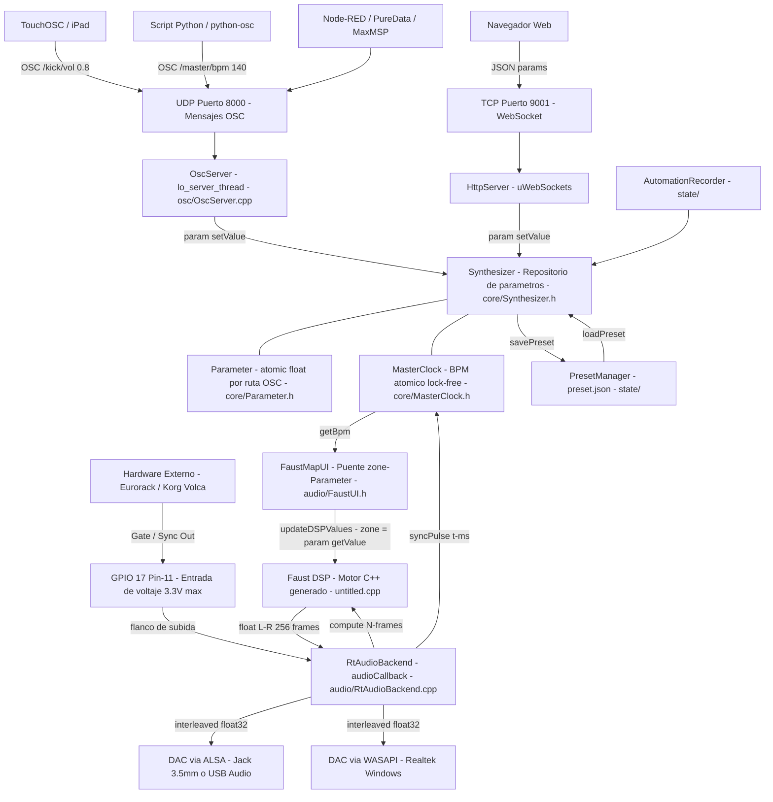
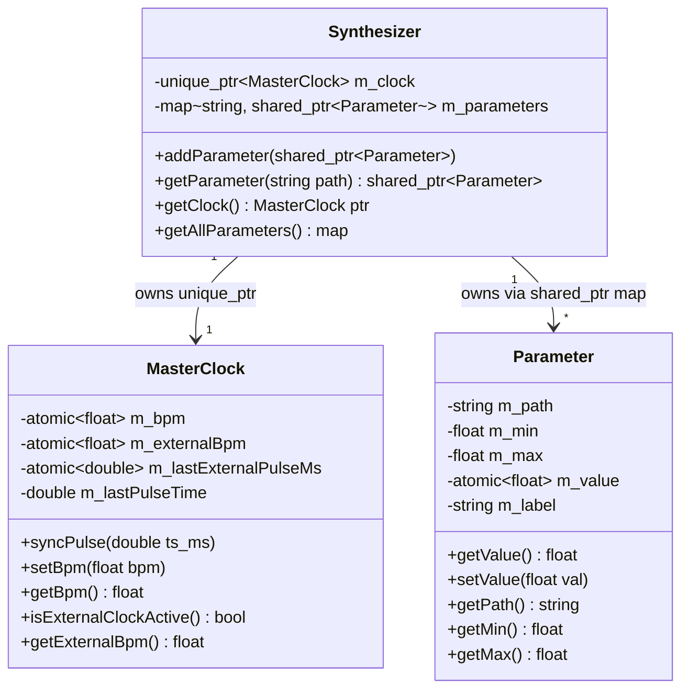
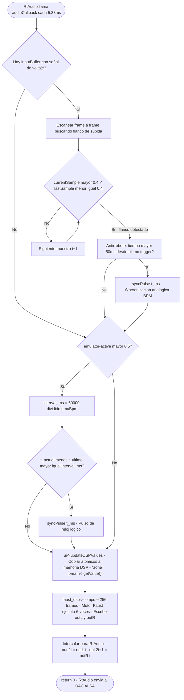
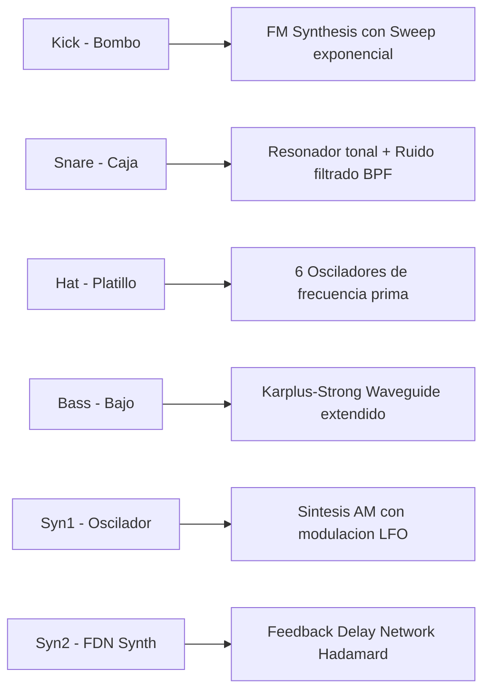
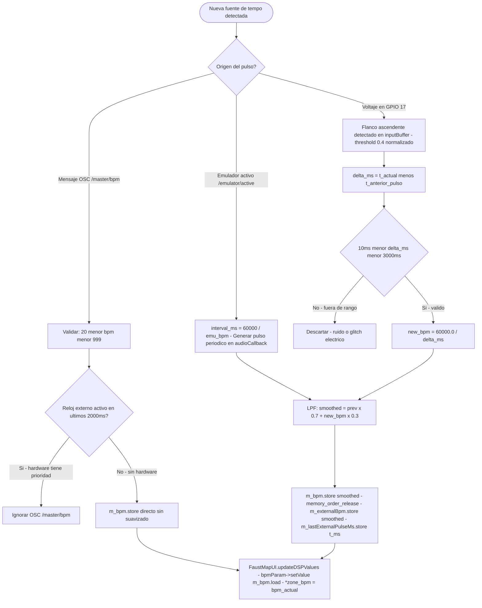
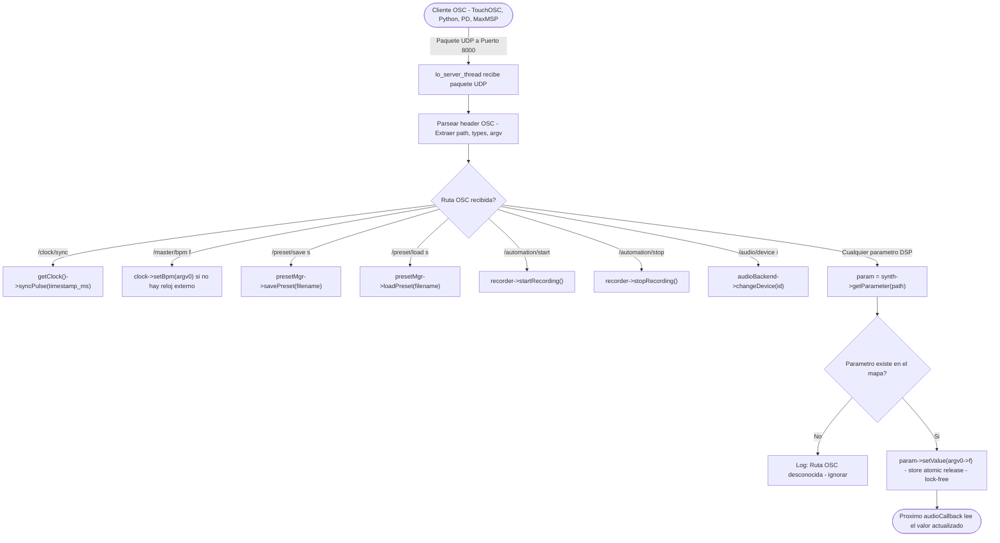
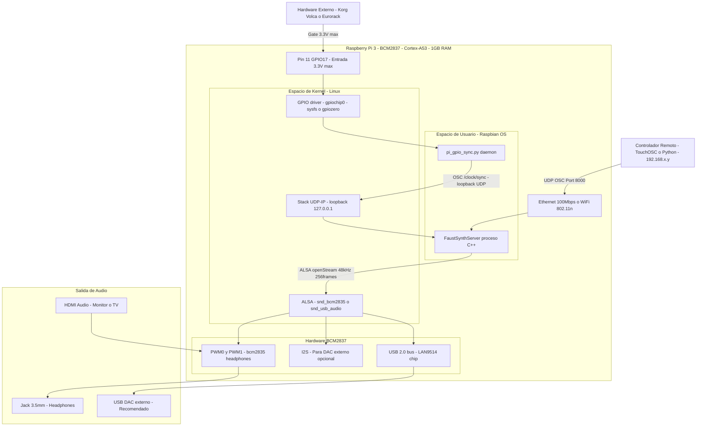
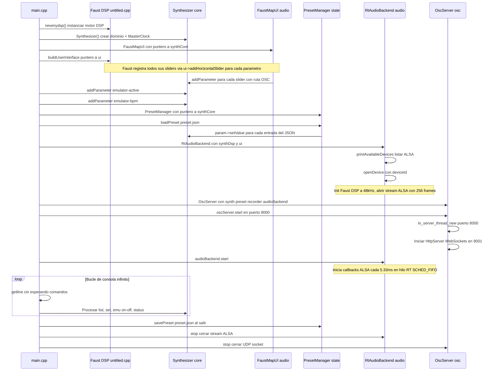

# BAZZ Algorithmic Techno Station — Documentación Técnica de Arquitectura

## AUTOR: Santiago Alexander Zambrano Chicunque

> **FaustSynthServer** · Estación de ritmos algorítmica de baja latencia
> Motor DSP en C++17 · Faust · RtAudio · liblo OSC · uWebSockets · **Raspberry Pi 3 (BCM2837 / Cortex-A53)**

---

## Índice

1. [Visión General del Sistema](#1-visión-general-del-sistema)
2. [Diagrama de Arquitectura Global](#2-diagrama-de-arquitectura-global)
3. [Hardware: Raspberry Pi 3 — Especificaciones Técnicas](#3-hardware-raspberry-pi-3--especificaciones-técnicas)
4. [Módulo Core — Dominio del Sintetizador](#4-módulo-core--dominio-del-sintetizador)
5. [Motor DSP — Pipeline de Audio (Faust + RtAudio)](#5-motor-dsp--pipeline-de-audio-faust--rtaudio)
6. [Diseño del Buffer de Audio](#6-diseño-del-buffer-de-audio)
7. [Arquitectura Acústica del Sintetizador](#7-arquitectura-acústica-del-sintetizador)
8. [Sistema de Reloj Maestro (MasterClock)](#8-sistema-de-reloj-maestro-masterclock)
9. [Conexiones OSC — Protocolo y Rutas](#9-conexiones-osc--protocolo-y-rutas)
10. [Vista Completa desde Raspberry Pi 3](#10-vista-completa-desde-raspberry-pi-3)
11. [Vista desde Windows (WASAPI)](#11-vista-desde-windows-wasapi)
12. [Sincronización GPIO — Reloj de Hardware Externo](#12-sincronización-gpio--reloj-de-hardware-externo)
13. [Sistema de Estado — Presets y Automatización](#13-sistema-de-estado--presets-y-automatización)
14. [Flujo de Arranque Completo](#14-flujo-de-arranque-completo)
15. [Tablas de Parámetros](#15-tablas-de-parámetros)
16. [Dependencias y Compilación](#16-dependencias-y-compilación)

---

## 1. Visión General del Sistema

**FaustSynthServer** es un servidor de síntesis de audio en tiempo real, inspirado en la TR-808 de Roland, diseñado como una caja de ritmos algorítmica con síntesis procedural completamente en software. El sistema está optimizado para correr en modo **headless** (sin pantalla ni teclado) sobre una **Raspberry Pi 3**, actuando como instrumento de hardware dedicado, controlado remotamente vía red OSC desde cualquier dispositivo.

### Pilares tecnológicos

| Pilar | Tecnología | Rol |
|---|---|---|
| **Síntesis DSP** | Faust → C++ transpilado | Motor de síntesis (untitled.cpp) |
| **E/S de Audio** | RtAudio + ALSA | Comunicación con el hardware DAC |
| **Control Remoto** | liblo (OSC/UDP) | Parámetros en tiempo real vía red |
| **Interfaz Web** | uWebSockets + libuv | UI en navegador por WebSocket |
| **Estado** | nlohmann/json | Persistencia de presets en disco |
| **Sincronización** | GPIO 17 + MasterClock | Reloj analógico desde hardware externo |

### Filosofía de diseño

- **Lock-free entre hilos**: todos los parámetros son `std::atomic<float>`, sin mutex en el camino de audio.
- **Tiempo real estricto**: el callback de audio nunca llama a `new`, `malloc`, ni E/S de disco.
- **Bajo consumo**: diseñado para el Cortex-A53 de la RPi 3, con vectorización NEON explícita.
- **Recuperación automática**: al apagarse, guarda `preset.json`; al encender, lo restaura.

---

## 2. Diagrama de Arquitectura Global

> Diagrama compatible con GitHub Mermaid (sin `direction` dentro de subgraphs).



### Flujo de datos por capas

```
[ Controladores Externos ] ──UDP/WebSocket──▶ [ Capa OSC/Web ]
                                                      │
                                                      ▼ param->setValue() lock-free
                                              [ Capa Core - Synthesizer ]
                                              [ Parameter(atomic) + MasterClock ]
                                                      │
                                          updateDSPValues() cada callback
                                                      │
                                                      ▼
                                           [ Capa Audio - Faust DSP ]
                                           compute(256 frames, in, out)
                                                      │
                                                      ▼
                                             [ Hardware DAC / ALSA ]
                                             Jack 3.5mm / USB Audio
```

---

## 3. Hardware: Raspberry Pi 3 — Especificaciones Técnicas

### SoC y CPU

| Componente | Detalle |
|---|---|
| **SoC** | Broadcom BCM2837 |
| **CPU** | ARM Cortex-A53 (ARMv8-A, 64-bit) |
| **Núcleos** | 4 núcleos @ **1.2 GHz** (RPi 3B) / **1.4 GHz** (RPi 3B+) |
| **Arquitectura** | AArch64 (64-bit) / AArch32 compatible |
| **Cache L1** | 32 KB instrucciones + 32 KB datos por núcleo |
| **Cache L2** | 512 KB compartida (todos los núcleos) |
| **RAM** | **1 GB LPDDR2 @ 900 MHz** |
| **GPU** | VideoCore IV @ 400 MHz (no se usa para audio) |
| **SIMD** | ARM NEON (Advanced SIMD) — 128-bit vectorización |

### Interfaces de conectividad

| Interfaz | Detalle RPi 3B | Detalle RPi 3B+ |
|---|---|---|
| **Ethernet** | 100 Mbps (LAN9514) | ~300 Mbps via USB3 (LAN7515) |
| **WiFi** | 802.11 b/g/n (2.4 GHz) | 802.11 b/g/n/ac (2.4 + 5 GHz) |
| **Bluetooth** | BT 4.1 + BLE | BT 4.2 + BLE |
| **USB** | 4x USB 2.0 (bus compartido) | 4x USB 2.0 (bus compartido) |
| **GPIO** | 40 pines (3.3V lógica) | 40 pines (3.3V lógica) |
| **Audio** | Jack 3.5mm (bcm2835 PWM) + HDMI | Ídem |
| **Consumo** | ~2.5W típico, ~6.7W máx | ~2.5W típico, ~6.7W máx |
| **Alimentación** | 5V / 2.5A microUSB | 5V / 2.5A microUSB |

### Audio en la Raspberry Pi 3

La RPi 3 usa el driver `snd_bcm2835` que implementa dos salidas nativas:

```
BCM2837 SoC
├── PWM0  ──────┐
│               ├── RC filter pasivo ──── Jack 3.5mm (snd_bcm2835 Headphones)
└── PWM1  ──────┘                         Resolución: 11-bit efectivos @ 48kHz
                                          SNR: ~70 dB (limitado por PWM)
└── HDMI I2S ─────────────────────────── HDMI Audio (snd_bcm2835 HDMI)
                                          Resolución: 16-bit

[ USB DAC externo ]
└── snd_usb_audio ────────────────────── USB 2.0 (Clase USB Audio)
                                          Hasta 24-bit / 192kHz (depende del DAC)
                                          RECOMENDADO para producción
```

> **Recomendación**: Para audio de calidad usar un **USB DAC** (ej: Behringer UCA202, IQaudio DAC+, o cualquier interfaz clase USB Audio). El jack 3.5mm nativo tiene ruido PWM audible.

### Mapa de pines GPIO (40 pines)

```
Raspberry Pi 3 — Conector GPIO J8 (40 pines)
┌────────┬──────┬──────────┬────────────────────────────────────────┐
│ Pin Fís│ GPIO │ Función  │ Uso en este proyecto                   │
├────────┼──────┼──────────┼────────────────────────────────────────┤
│  1     │  —   │ 3.3V PWR │ Alimentación de lógica (NO usar como out)│
│  2     │  —   │ 5V PWR   │ Alimentación 5V                        │
│  6     │  —   │ GND      │ Masa general                           │
│  9     │  —   │ GND      │ GND de referencia del reloj externo    │
│  11    │  17  │ GPIO IN  │ *** CLOCK IN — Entrada de voltaje sync ***│
│  12    │  18  │ GPIO     │ Disponible (PCM_CLK si se usa I2S DAC) │
│  14    │  —   │ GND      │ Masa adicional                         │
│  19    │  10  │ SPI_MOSI │ SPI (si se usa DAC por SPI)            │
│  21    │  9   │ SPI_MISO │ SPI                                    │
│  23    │  11  │ SPI_CLK  │ SPI                                    │
│  24    │  8   │ SPI_CE0  │ SPI Chip Select 0                      │
│  35    │  19  │ PCM_FS   │ I2S DAC Frame Sync                     │
│  38    │  20  │ PCM_DIN  │ I2S DAC Data IN                        │
│  40    │  21  │ PCM_DOUT │ I2S DAC Data OUT                       │
└────────┴──────┴──────────┴────────────────────────────────────────┘

CONEXIÓN CRÍTICA:
  Pin 11 (GPIO 17) ──── Señal Clock/Gate externa (máx 3.3V)
  Pin 9  (GND)     ──── Masa del dispositivo externo
```

### Rendimiento DSP en el Cortex-A53

El Cortex-A53 es un núcleo **in-order** (a diferencia del out-of-order Cortex-A72 del RPi 4). Esto tiene implicaciones para el DSP:

```
Cortex-A53 @ 1.2 GHz:
  Ciclos por segundo:    1,200,000,000
  Muestras por segundo:  48,000
  Ciclos por muestra:    1,200,000,000 / 48,000 = 25,000 ciclos/muestra

NEON (Advanced SIMD):
  Procesa 4x float32 en paralelo por instrucción VMUL/VADD
  Throughput VMUL.F32:  1 instrucción por ciclo (pipeline completo)
  Throughput efectivo:  4 muestras × 1.2 GHz = 4.8 GFLOPS de punto flotante

Tiempo de buffer (256 frames):
  Buffer de audio:  256 / 48000 = 5.33 ms disponibles por callback
  Uso típico DSP:   ~2-3 ms (40-60% de CPU en RPi 3)
  Margen seguro:    ~2-3 ms (headroom para jitter del SO)
```

---

## 4. Módulo Core — Dominio del Sintetizador

### Diagrama de clases



### Diseño lock-free de parámetros

El diseño garantiza **cero bloqueos** entre el hilo de audio (tiempo real) y los hilos de red (OSC / WebSocket):

```
┌─────────────────────────────────────────────────────────────────────┐
│                    MODELO DE CONCURRENCIA                           │
│                                                                     │
│  Hilo OSC (red, no RT)          Hilo Audio (RT, ALSA callback)     │
│  ─────────────────────          ───────────────────────────────     │
│  param->setValue(v)             ui->updateDSPValues()              │
│    │                              │                                 │
│    ▼                              ▼                                 │
│  m_value.store(v,               *dsp_zone = m_value.load(          │
│    memory_order_release)          memory_order_acquire)            │
│                                                                     │
│  GARANTÍA: release/acquire pair ─▶ visibilidad total sin mutex     │
│  COSTO:    ~1 ciclo de CPU (una instrucción DMB/STLR en AArch64)   │
└─────────────────────────────────────────────────────────────────────┘
```

**Instrucciones ARM generadas para RPi 3 (AArch64):**
```asm
; store con memory_order_release → STLR (Store-Release)
STLR  W0, [X1]        ; atómica, barrera de memoria implícita

; load con memory_order_acquire → LDAR (Load-Acquire)
LDAR  W0, [X1]        ; atómica, barrera de memoria implícita
```

Esto es más eficiente que `std::mutex` (que requiere syscalls `futex` costosas).

### Mapa de parámetros por ruta OSC

```
Synthesizer::m_parameters
├── "/master/bpm"        ← Parameter(20.0, 999.0, 140.0)
├── "/master/accent"     ← Parameter(0.0, 1.0, 0.5)
├── "/kick/vol"          ← Parameter(0.0, 1.0, 0.114)
├── "/kick/tune"         ← Parameter(0.0, 1.0, 0.463)
├── "/kick/dec"          ← Parameter(0.01, 1.0, 0.07)
├── "/kick/sweep"        ← Parameter(0.0, 500.0, 150.0)
├── "/snare/vol"         ← Parameter(0.0, 1.0, 0.0)
├── "/snare/dec_cuerpo"  ← Parameter(0.01, 1.0, 0.07)
├── "/hat/vol"           ← Parameter(0.0, 1.0, 0.0)
├── "/hat/cutoff"        ← Parameter(500.0, 20000.0, 4754.86)
├── "/bass/vol"          ← Parameter(0.0, 1.0, 0.0)
├── "/bass/detune"       ← Parameter(0.0, 0.5, 0.04)
├── "/syn1/vol"          ← Parameter(0.0, 1.0, 0.03)
├── "/syn2/vol"          ← Parameter(0.0, 1.0, 0.22)
├── "/emulator/active"   ← Parameter(0.0, 1.0, 0.0)   [manual]
└── "/emulator/bpm"      ← Parameter(60.0, 240.0, 137.0) [manual]
    ... (todos los parametros del DSP Faust)
```

---

## 5. Motor DSP — Pipeline de Audio (Faust + RtAudio)

### Diagrama de flujo del callback de audio



### Configuración del stream ALSA en Raspberry Pi 3

| Parámetro | Valor | Justificación para RPi 3 |
|---|---|---|
| **Sample Rate** | 48,000 Hz | Soportado nativamente por bcm2835 y USB DAC |
| **Buffer Size** | 256 frames | 5.33 ms — balance ideal CPU/latencia en Cortex-A53 |
| **Formato** | RTAUDIO_FLOAT32 | 32-bit float normalizado ±1.0 |
| **Canales salida** | 2 (Stereo) | Definido por Faust `getNumOutputs()` |
| **Canales entrada** | 1 (Mono) | Para detección de voltaje de reloj analógico |
| **API Linux** | ALSA (`__LINUX_ALSA__`) | Driver nativo del kernel, sin PulseAudio overhead |
| **Dispositivo** | auto o ID manual | `0` = default, `1` = headphones, `2` = USB DAC |

### Hilo de audio en Linux (ALSA + POSIX RT)

```
RtAudio en Linux crea un hilo POSIX dedicado para el callback:

  POSIX thread (pthread_create)
  ├── Política de scheduling: SCHED_FIFO (tiempo real)
  ├── Prioridad: 80 (de 0 a 99, mayor = más prioritario)
  ├── CPU affinity: ninguna fija (SO asigna al núcleo libre)
  └── Stack size: default (~8 MB)

  En RPi 3 con 4 núcleos Cortex-A53:
    Núcleo 0: generalmente reservado para interrupciones del SO
    Núcleo 1: hilo de audio (SCHED_FIFO, prioridad alta)
    Núcleo 2: hilo OSC + WebSocket
    Núcleo 3: hilo principal (consola) + systemd
```

---

## 6. Diseño del Buffer de Audio

### Problema: Intercalado vs No-intercalado

RtAudio y Faust usan formatos de buffer diferentes. El callback resuelve esto con buffers estáticos intermedios:

```
FORMATO FAUST (no intercalado / planar):
  outL[256] = [ L[0], L[1], L[2], ..., L[255] ]   (canal izquierdo)
  outR[256] = [ R[0], R[1], R[2], ..., R[255] ]   (canal derecho)

FORMATO RTAUDIO (intercalado / interleaved):
  out[512]  = [ L[0], R[0], L[1], R[1], ..., L[255], R[255] ]

CONVERSION en el callback:
  for (unsigned int i = 0; i < 256; i++) {
      out[2 * i]     = outL[i];   // muestra izquierda
      out[2 * i + 1] = outR[i];   // muestra derecha
  }
```

### Memoria del buffer en la RPi 3

```
Buffers estáticos (static local, asignados al inicio):
  static float outL[4096]  →  4096 × 4 bytes = 16,384 bytes = 16 KB
  static float outR[4096]  →  4096 × 4 bytes = 16,384 bytes = 16 KB
  float* faustOut[2]       →  2 × 8 bytes    =     16 bytes

  Total por callback: ~32 KB en stack estático

  RAM total disponible en RPi 3:  1,024 MB
  RAM usada por el proceso:       ~50-80 MB (código + Faust DSP)
  Headroom disponible:            ~900 MB (amplio margen)
```

> **Regla de tiempo real**: Los buffers usan `static` — el compilador los coloca en BSS/data segment, nunca en heap. En el callback de audio **no se llama a `new`, `malloc`, `free`, ni a ninguna función de E/S**. Esto es esencial para evitar *priority inversion* y *jitter* en ALSA.

### Análisis de latencia completa en Raspberry Pi 3

```
Cadena de latencia de audio (RPi 3, ALSA, 256 frames @ 48kHz):

  ┌────────────────────────────────────────────────────────────┐
  │ Etapa                          │ Latencia   │ Notas        │
  ├────────────────────────────────┼────────────┼──────────────┤
  │ Síntesis Faust (6 voces)       │ ~1.5-2 ms  │ DSP puro     │
  │ Buffer RtAudio (256 frames)    │  5.33 ms   │ fijo         │
  │ Driver ALSA (snd_bcm2835)      │  ~2-4 ms   │ doble buffer │
  │ DAC bcm2835 PWM (jack 3.5mm)   │  ~0.2 ms   │ RC filter    │
  │ DAC USB externo (si se usa)    │  ~1-3 ms   │ USB latency  │
  ├────────────────────────────────┼────────────┼──────────────┤
  │ TOTAL (jack nativo)            │  ~9-11 ms  │ aceptable    │
  │ TOTAL (USB DAC)                │  ~10-14 ms │ OK para ritmo│
  └────────────────────────────────┴────────────┴──────────────┘

Latencia musical percibida:
  A 140 BPM, un beat dura 428 ms.
  Una latencia de 10 ms = 10/428 = 2.3% del beat.
  Imperceptible musicalmente (umbral humano ≈ 20-30 ms).
```

---

## 7. Arquitectura Acústica del Sintetizador

El sintetizador implementa **6 voces de síntesis** independientes, cada una con un modelo físico/matemático propio:

### Mapa de voces y técnicas



### Matemática detallada de síntesis por voz

#### Bombo (Kick) — FM + Sweep Exponencial

El bombo emula el comportamiento de una membrana percutida: alta frecuencia al inicio que decae exponencialmente.

```
MODELO FÍSICO: Membrana circular tensada (aproximación de modos)

Frecuencia instantánea:
  f(t) = f_base + sweep × e^(−t / τ_f)

  f_base  = nota_MIDI → Hz = 440 × 2^((nota − 69) / 12)
  sweep   = barrido en Hz    → parámetro /kick/sweep (0–500 Hz)
  τ_f     = constante de tiempo de frecuencia ≈ dec/3
  t       = tiempo desde el trigger [segundos]

Ángulo de fase acumulado (integración de la frecuencia instantánea):
  φ(t) = 2π ∫₀ᵗ f(τ) dτ
       = 2π [ f_base·t  −  sweep·τ_f·(e^(−t/τ_f) − 1) ]

Señal de salida:
  y(t) = A(t) × sin(φ(t))

Envolvente de amplitud (Percussive Exponential):
  A(t) = e^(−t / τ_A)
  τ_A = dec × 1.5   → parámetro /kick/dec

Compresor interno (Waveshaper):
  y_comp = sgn(y) × (1 − e^(−|y| × drive))  si comp_thresh activo
```

#### Caja (Snare) — Modelo Cuerpo + Resorte

```
MODELO FÍSICO: Parche superior (tonal) + resortes de snare (ruido)

Señal total:
  y(t) = mix × y_body(t) + (1 − mix) × y_spring(t)

--- CUERPO (componente tonal) ---
  y_body(t) = sin(2π × f_body × t) × e^(−t / τ_body)

  f_body  = /snare/freq  (Hz)  — resonancia del parche
  τ_body  = /snare/dec_cuerpo

  Filtrado adicional:
  BPF centrado en f_body con Q = /snare/q
  HP a f = /snare/hp para eliminar sub-graves

--- RESORTES (componente de ruido) ---
  n(t) = ruido_blanco_uniforme()  ∈ [−1, 1]

  y_spring_raw(t) = BPF[fc=/snare/freq, Q=/snare/q]( n(t) )
  y_spring(t)     = y_spring_raw(t) × e^(−t / τ_spring)
  τ_spring        = /snare/dec_resorte

  Saturación armónica (drive):
  y_spring = tanh(y_spring × drive) / tanh(drive)

  Afinación: semitonos = /snare/tune
  Transposición: f_body = f_body × 2^(tune/12)
```

#### Platillo (Hat) — Banco de Osciladores Metálicos

```
MODELO FÍSICO: Plato de metal con modos de vibración no armónicos

La metalicidad se logra con 6 osciladores a frecuencias primas (no armónicas):
  ratio_primos = [1.0, 1.413, 1.732, 2.145, 2.618, 3.000]

  f_n = f_base × ratio_primos[n]    n = 0..5
  f_base se controla con /hat/tune

  Señal bruta:
  y_metal(t) = Σ(n=0 a 5) sin(2π × f_n × t)

  Filtrado:
  y_filt = HPF[fc=2000Hz](LPF[fc=/hat/cutoff](y_metal))

  Envolvente:
  A(t) = e^(−t / τ_hat)
  τ_hat = /hat/dec

  Mix open/closed:
  y(t) = mix × A_closed(t) + (1−mix) × A_open(t)

  Saturación: y = tanh(y × drive)
```

#### Bajo Waveguide — Karplus-Strong Extendido

```
MODELO FÍSICO: Cuerda pulsada con reflexión en los extremos

Algoritmo Karplus-Strong:
  Inicialización (trigger):
    delay_line[0..L-1] = ruido_uniforme() × 0.5

  Por cada muestra n:
    y[n] = 0.5 × (delay_line[(n-L) mod L] + delay_line[(n-L-1) mod L])
    y[n] = y[n] × g_decay               ← amortiguamiento
    delay_line[n mod L] = y[n]

  Longitud del delay (afinación):
    L = round(Fs / f_nota)
    f_nota = 440 × 2^((nota − 69) / 12)
    Fs = 48000 Hz

  Factor de decaimiento por muestra:
    g_decay = e^(−1 / (τ_dec × Fs))
    τ_dec = /bass/dec

  EXTENSIÓN 1 — Detune (coro de 2 voces):
    L_1 = L
    L_2 = round(L × (1 + detune))      ← /bass/detune
    Salida = (y_1 + y_2) / 2

  EXTENSIÓN 2 — Saturación armónica:
    y_out = tanh(y × drive) / tanh(drive)  ← /bass/drive

  EXTENSIÓN 3 — LFO de modulación:
    f_lfo = 0.1 + lfo_depth × 10        ← /bass/lfo
    L_mod = L × (1 + 0.01 × sin(2π × f_lfo × t))
```

#### Syn2 — FDN (Feedback Delay Network)

```
MODELO: Reverberación sintética con densidad modal controlable

Red de N=4 delays con retroalimentación matricial:

  Para cada muestra n:
    x_in[i] = input[n]  +  Σ(j=0 a 3) H[i][j] × y[n-1][j]
    y[n][i]  = x_in[i]   (despues de pasar por delay_line[i])

  Longitudes de delay (dispersivas, basadas en primos):
    primos = [29, 37, 41, 53]
    L_i = round(disp × 48000 × 0.005 × primos[i] / 53)
    /syn2/disp controla la densidad de ecos (0.0 = muy seco, 1.0 = muy denso)

  Matriz de mezcla H (Hadamard normalizada 4×4):
    H = (1/2) × | 1  1  1  1 |
                 | 1 -1  1 -1 |
                 | 1  1 -1 -1 |
                 | 1 -1 -1  1 |

  La matriz Hadamard garantiza:
    - Mezcla perfecta sin cancelaciones de fase
    - Densidad modal uniforme
    - Estabilidad garantizada (valor singular máximo = 1)

  LFO de modulación de delays:
    φ_lfo[n] = 2π × f_lfo × n / Fs     ← /syn2/lfo_f y /syn2/lfo_p
    L_i_mod = L_i × (1 + 0.005 × sin(φ_lfo + π×i/2))

  Compresor de salida (limitador dinámico):
    gain = 10^(comp_th / 20)            ← /syn2/comp_th en dBFS
    y_comp = limiter(y_out, gain, attack, release)
```

---

## 8. Sistema de Reloj Maestro (MasterClock)

El `MasterClock` es el corazón temporal del sistema. Recibe pulsos de **tres fuentes** y exporta el BPM suavizado a todo el motor DSP.

### Diagrama de decisión del MasterClock



### Matemática del filtro IIR de primer orden (suavizado de BPM)

El BPM crudo detectado tiene jitter (variación pulso a pulso). Se aplica un filtro paso-bajo exponencial:

```
FILTRO IIR DE PRIMER ORDEN (Exponential Moving Average):

  BPM_s[n] = α × BPM_raw[n] + (1−α) × BPM_s[n−1]

  Con α = 0.3:
  BPM_s[n] = 0.3 × BPM_raw[n] + 0.7 × BPM_s[n−1]

FUNCIÓN DE TRANSFERENCIA EN DOMINIO Z:
  H(z) = α / (1 − (1−α)·z⁻¹)
       = 0.3 / (1 − 0.7·z⁻¹)

  Polo en z = 0.7  →  estable (|polo| < 1)
  Frecuencia de corte: fc = arccos(0.7) / (2π) × f_Nyquist

CONVERGENCIA (respuesta al escalón de BPM):
  BPM_s[N] = BPM_final × (1 − 0.7^N)

  N = 1  →  30.0%  convergencia
  N = 3  →  65.7%  convergencia
  N = 5  →  83.2%  convergencia
  N = 10 →  97.2%  convergencia
  N = 20 →  99.9%  convergencia

TIEMPO DE RESPUESTA A 140 BPM:
  Intervalo entre pulsos = 60000 / 140 = 428.6 ms
  Al 83% (5 pulsos):  5 × 428.6 ms = 2.14 segundos
  Al 97% (10 pulsos): 10 × 428.6 ms = 4.29 segundos

JITTER ATENUADO:
  Si el jitter de un pulso es ±5 ms (error relativo = 5/428 = 1.17%),
  el filtro lo atenúa en cada paso por factor 0.3:
  Jitter_filtrado ≈ 0.3 × 5 ms = 1.5 ms de variación residual.
  A 140 BPM esto representa < 0.35% de error de tempo.
```

### Timeout y prioridad de reloj

```
isExternalClockActive():
  now_ms      = steady_clock::now() en milisegundos
  last_pulse  = m_lastExternalPulseMs.load(acquire)
  return (now_ms − last_pulse) < 2000.0

LÓGICA DE PRIORIDAD:
  1. Reloj analógico GPIO (máxima prioridad)
     → Si llega pulso de voltaje: syncPulse() y resetea el timeout
  2. Reloj OSC /master/bpm
     → Solo actúa si isExternalClockActive() == false (timeout > 2s)
  3. Emulador interno (/emulator/active = 1)
     → Genera pulsos periódicos en el callback de audio
     → Puede coexistir con OSC, pero tiene menor prioridad que GPIO
```

---

## 9. Conexiones OSC — Protocolo y Rutas

### ¿Qué es OSC?

**Open Sound Control (OSC)** es un protocolo de comunicación para dispositivos musicales, sucesor espiritual del MIDI. Usa UDP sobre IP, lo que lo hace extremadamente rápido y flexible. Cada mensaje OSC contiene:

```
Paquete UDP OSC:
┌──────────────────────────────────────────────────────────┐
│ Address Pattern: string terminado en null con padding    │
│   Ejemplo: "/kick/vol\0\0\0"  (múltiplo de 4 bytes)      │
│                                                          │
│ Type Tag String: ",f\0\0" (coma + tipos + nulls)         │
│   f = float32, i = int32, s = string, b = blob           │
│                                                          │
│ Arguments: datos en big-endian                           │
│   float32: 4 bytes IEEE 754                              │
└──────────────────────────────────────────────────────────┘

Tamaño típico de un mensaje /kick/vol con 1 float:
  12 bytes (address) + 8 bytes (type tag) + 4 bytes (float) = 24 bytes
  Esto es ~70x más compacto que JSON equivalente.
```

### Flujo del servidor OSC



### Tabla de rutas OSC — Referencia completa

#### Globales / Master

| Ruta | Tipo | Rango | Default | Descripción |
|---|---|---|---|---|
| `/master/bpm` | `f` | 20 – 999 | 140.0 | Tempo maestro BPM |
| `/master/accent` | `f` | 0.0 – 1.0 | 0.5 | Acentuación global |
| `/master/nota` | `f` | 0 – 127 | 36 | Nota raíz MIDI |
| `/master/groove` | `f` | 0 – 6 | 0 | Patrón algorítmico |
| `/clock/sync` | — | — | — | Pulso de reloj externo |
| `/emulator/active` | `f` | 0 / 1 | 0 | Emulador de clock on/off |
| `/emulator/bpm` | `f` | 60 – 240 | 137 | BPM del emulador |

#### Bombo (Kick)

| Ruta | Tipo | Rango | Default | Descripción |
|---|---|---|---|---|
| `/kick/vol` | `f` | 0.0 – 1.0 | 0.114 | Volumen |
| `/kick/tune` | `f` | 0.0 – 1.0 | 0.463 | Afinación base |
| `/kick/dec` | `f` | 0.01 – 1.0 | 0.07 | Decaimiento |
| `/kick/sweep` | `f` | 0 – 500 | 150 | Barrido de frecuencia Hz |
| `/kick/mix` | `f` | 0.0 – 1.0 | 0.425 | Mix cuerpo/tono |
| `/kick/groove` | `f` | 0 – 6 | 2 | Patrón rítmico |
| `/kick/swing` | `f` | 0 – 100 | 0 | Swing porcentaje |
| `/kick/accent` | `f` | 0.0 – 1.0 | 0.5 | Velocidad de acento |
| `/kick/comp_thresh` | `f` | 0.0 – 1.0 | 0.4 | Umbral compresor |
| `/kick/comp_ratio` | `f` | 1.0 – 10.0 | 1.988 | Ratio compresion |
| `/kick/comp_drive` | `f` | 0.0 – 5.0 | 1.036 | Drive saturacion |
| `/kick/comp_fmin` | `f` | 20 – 500 | 100 | Freq min compresor |
| `/kick/comp_fmax` | `f` | 500 – 20k | 7583 | Freq max compresor |
| `/kick/nota` | `f` | 0 – 127 | 38 | Nota MIDI |
| `/kick/reloj` | `f` | 0.25 – 4.0 | 0.25 | Division de tiempo |

#### Caja (Snare)

| Ruta | Tipo | Rango | Default | Descripción |
|---|---|---|---|---|
| `/snare/vol` | `f` | 0.0 – 1.0 | 0.0 | Volumen |
| `/snare/dec_cuerpo` | `f` | 0.01 – 1.0 | 0.07 | Decay del cuerpo |
| `/snare/dec_resorte` | `f` | 0.01 – 1.0 | 0.16 | Decay del resorte |
| `/snare/freq` | `f` | 100 – 5000 | 1551 | Frecuencia resonancia |
| `/snare/q` | `f` | 0.1 – 20.0 | 3.016 | Factor Q filtro |
| `/snare/hp` | `f` | 20 – 500 | 184 | Corte highpass |
| `/snare/tune` | `f` | -24 – +24 | -6.7 | Afinacion semitonos |
| `/snare/drive` | `f` | 0.0 – 10.0 | 3.51 | Saturacion |
| `/snare/mix` | `f` | 0.0 – 1.0 | 0.352 | Mix cuerpo-resorte |
| `/snare/groove` | `f` | 0 – 6 | 4 | Patron ritmico |

#### Platillo (Hat)

| Ruta | Tipo | Rango | Default | Descripción |
|---|---|---|---|---|
| `/hat/vol` | `f` | 0.0 – 1.0 | 0.0 | Volumen |
| `/hat/dec` | `f` | 0.001 – 2.0 | 0.15 | Decay |
| `/hat/tune` | `f` | -1.0 – 1.0 | -0.005 | Afinacion osciladores |
| `/hat/cutoff` | `f` | 500 – 20000 | 4754 | Cutoff filtro LP Hz |
| `/hat/mix` | `f` | 0.0 – 1.0 | 0.611 | Mix closed/open |
| `/hat/drive` | `f` | 0.0 – 1.0 | 0.206 | Saturacion |
| `/hat/ataque` | `f` | 0.001 – 0.1 | 0.001 | Tiempo de ataque |
| `/hat/groove` | `f` | 0 – 6 | 6 | Patron ritmico |
| `/hat/swing` | `f` | 0 – 100 | 48.4 | Swing |

#### Bajo Waveguide (Bass)

| Ruta | Tipo | Rango | Default | Descripción |
|---|---|---|---|---|
| `/bass/vol` | `f` | 0.0 – 1.0 | 0.0 | Volumen |
| `/bass/nota` | `f` | 0 – 127 | 43 | Nota MIDI base |
| `/bass/dec` | `f` | 0.01 – 2.0 | 0.57 | Decaimiento waveguide |
| `/bass/detune` | `f` | 0.0 – 0.5 | 0.04 | Detune efecto coro |
| `/bass/intervalo` | `f` | -24 – +24 | -12 | Intervalo armonico |
| `/bass/drive` | `f` | 0.0 – 2.0 | 0.65 | Saturacion armonica |
| `/bass/lfo` | `f` | 0.0 – 1.0 | 0.45 | Profundidad LFO |
| `/bass/groove` | `f` | 0 – 6 | 6 | Patron ritmico |
| `/bass/swing` | `f` | 0 – 100 | 0 | Swing |

#### Sintetizador AM (Syn1)

| Ruta | Tipo | Rango | Default | Descripción |
|---|---|---|---|---|
| `/syn1/vol` | `f` | 0.0 – 1.0 | 0.03 | Volumen |
| `/syn1/nota` | `f` | 0 – 127 | 45 | Nota base |
| `/syn1/dec` | `f` | 0.01 – 2.0 | 0.12 | Decay |
| `/syn1/osc1` | `f` | 1 – 100 | 11.01 | Ratio oscilador 1 |
| `/syn1/osc2` | `f` | 1 – 100 | 18.63 | Ratio oscilador 2 |
| `/syn1/auto_p` | `f` | 0.0 – 1.0 | 0.959 | Probabilidad auto |
| `/syn1/auto_r` | `f` | 0.0 – 10.0 | 7.135 | Rango auto |
| `/syn1/auto_v` | `f` | 0.0 – 1.0 | 0.805 | Velocidad auto |

#### Sintetizador FDN (Syn2)

| Ruta | Tipo | Rango | Default | Descripción |
|---|---|---|---|---|
| `/syn2/vol` | `f` | 0.0 – 1.0 | 0.22 | Volumen |
| `/syn2/dec` | `f` | 0.001 – 2.0 | 0.01 | Decay ataque |
| `/syn2/nota` | `f` | 0 – 127 | 24 | Nota base |
| `/syn2/disp` | `f` | 0.0 – 1.0 | 0.654 | Dispersion modal FDN |
| `/syn2/lfo_f` | `f` | 0.1 – 20.0 | 19.1 | Frecuencia LFO |
| `/syn2/lfo_p` | `f` | 0.0 – 1.0 | 0.5 | Fase LFO |
| `/syn2/comp_th` | `f` | -60 – 0 | -20 | Umbral compresor dBFS |
| `/syn2/comp_a` | `f` | 0.001 – 1.0 | 0.069 | Attack compresor |
| `/syn2/comp_r` | `f` | 1 – 20 | 6 | Ratio compresor |
| `/syn2/comp_rel` | `f` | 0.01 – 2.0 | 0.1 | Release compresor |
| `/syn2/groove` | `f` | 0 – 6 | 6 | Patron ritmico |

#### Control del sistema

| Ruta | Tipo | Descripción |
|---|---|---|
| `/preset/save` | `s` | Guardar preset a archivo JSON |
| `/preset/load` | `s` | Cargar preset desde archivo JSON |
| `/automation/start` | — | Iniciar grabacion de automatizacion |
| `/automation/stop` | — | Detener grabacion |
| `/audio/device` | `i` | Cambiar dispositivo ALSA (ID entero) |

---

## 10. Vista Completa desde Raspberry Pi 3

### Diagrama de capas del sistema en RPi 3



### Modelo de procesos y hilos en Raspberry Pi 3

```
Sistema Linux (Raspbian / Raspberry Pi OS)
│
├── PID xxx: FaustSynthServer (proceso principal)
│   │
│   ├── Hilo 1: main() — hilo principal
│   │     Política: SCHED_OTHER (normal)
│   │     Función: bucle de consola stdin, carga/guarda preset
│   │
│   ├── Hilo 2: RtAudio ALSA callback (hilo de audio)
│   │     Política: SCHED_FIFO prioridad 80 (tiempo real)
│   │     Período:  cada 5.33 ms (256 frames @ 48kHz)
│   │     CPU:      preferentemente núcleo 1 o 2
│   │     Función:  detectar voltaje GPIO, actualizar params,
│   │               ejecutar Faust DSP, enviar a DAC
│   │
│   ├── Hilo 3: lo_server_thread (OSC listener)
│   │     Política: SCHED_OTHER
│   │     Puerto:   UDP 8000
│   │     Función:  recibir mensajes OSC, actualizar parametros
│   │
│   └── Hilo 4: uWebSockets + libuv (WebSocket server)
│         Política: SCHED_OTHER
│         Puerto:   TCP 9001
│         Función:  interfaz web en navegador
│
└── PID yyy: pi_gpio_sync.py (proceso Python daemon)
      Política: SCHED_OTHER (interrupciones gpiozero son rápidas)
      Función:  monitoriza GPIO 17, envía /clock/sync por UDP loopback
```

### Flags de compilación específicos para Cortex-A53 (RPi 3)

```cmake
# CMakeLists.txt — Bloque Linux (Raspberry Pi 3)
set(CMAKE_CXX_FLAGS "${CMAKE_CXX_FLAGS}
    -O3                      # Optimización máxima
    -ffast-math              # Relaxed IEEE 754: permite reordenamiento de operaciones FP
    -mcpu=cortex-a53         # Genera código optimizado para Cortex-A53 (RPi 3)
    -mtune=cortex-a53        # Ajusta pipeline scheduling al A53 (in-order)
    -mfpu=neon-fp-armv8      # Habilita instrucciones NEON ARMv8 (128-bit SIMD)
    -ftree-vectorize         # Auto-vectorización de bucles con NEON
    -funroll-loops           # Desenrollar bucles (reduce branch overhead en A53 in-order)
")
```

**Diferencias con RPi 4 (Cortex-A72):**

| Característica | RPi 3 (Cortex-A53) | RPi 4 (Cortex-A72) |
|---|---|---|
| **Arquitectura** | In-order | Out-of-order |
| **Flag CPU** | `-mcpu=cortex-a53` | `-mcpu=cortex-a72` |
| **Clock** | 1.2 / 1.4 GHz | 1.5 / 1.8 GHz |
| **IPC** | ~2 instrucciones/ciclo | ~3-4 instrucciones/ciclo |
| **NEON unidad** | 1 pipeline SIMD | 2 pipelines SIMD |
| **RAM** | 1 GB LPDDR2 | 2-8 GB LPDDR4 |
| **DSP overhead** | ~50-65% CPU | ~20-30% CPU |
| **Buffers seguros** | 256+ frames | 128+ frames |

> **Para RPi 3**: Se recomienda bufferSize de **256 o 512 frames** (no bajar de 256, el Cortex-A53 in-order necesita el margen adicional para evitar xruns ALSA).

### Instalación de dependencias en Raspberry Pi 3

```bash
# 1. Actualizar el sistema operativo
sudo apt update && sudo apt full-upgrade -y

# 2. Instalar herramientas de compilación
sudo apt install -y build-essential cmake git

# 3. Instalar ALSA (driver de audio nativo)
sudo apt install -y libasound2-dev

# 4. Instalar liblo (opcional, acelera compilación)
sudo apt install -y liblo-dev

# 5. Instalar Python y gpiozero (para el puente GPIO)
sudo apt install -y python3-pip python3-gpiozero
pip3 install python-osc

# 6. Configurar audio ALSA (seleccionar dispositivo por defecto)
# Para jack 3.5mm:
echo "options snd_bcm2835 index=0" | sudo tee /etc/modprobe.d/alsa-base.conf

# Para USB DAC (reemplaza al bcm2835 como default):
echo "options snd-usb-audio index=0" | sudo tee /etc/modprobe.d/alsa-base.conf
echo "options snd-bcm2835 index=1"  | sudo tee -a /etc/modprobe.d/alsa-base.conf
```

### Compilación en Raspberry Pi 3

```bash
# Navegar al directorio del proyecto
cd /home/pi/sintetizador

# Limpiar builds anteriores (importante si venía de Windows)
rm -rf build

# Configurar con CMake (detecta Linux y aplica flags Cortex-A53 automáticamente)
cmake -B build -S . -DCMAKE_BUILD_TYPE=Release

# Compilar usando los 4 núcleos del Cortex-A53
cmake --build build --config Release -j4

# El ejecutable queda en:
ls -lh build/FaustSynthServer
# Tamaño típico: 8-15 MB (incluye DSP Faust inlining)
```

### Ejecución en Raspberry Pi 3

```bash
# Con selección automática de dispositivo (usa default ALSA):
./build/FaustSynthServer

# Con dispositivo específico (ej: USB DAC = ID 2):
./build/FaustSynthServer 2

# Consola interactiva disponible:
synth-server> list          # Listar dispositivos ALSA
synth-server> set 2         # Cambiar a USB DAC
synth-server> emu on        # Activar emulador de reloj (sin hardware externo)
synth-server> emu bpm 128   # Establecer tempo del emulador
synth-server> status        # Ver estado completo
synth-server> exit          # Guardar preset y salir
```

### Servicio systemd — Modo Headless (RPi 3 como instrumento)

```bash
# Crear archivo de servicio del sintetizador
sudo nano /etc/systemd/system/synthesizer.service
```

```ini
[Unit]
Description=BAZZ Algorithmic Synth Server - FaustSynthServer
After=network.target sound.target
Wants=sound.target

[Service]
Type=simple
User=pi
Group=audio
WorkingDirectory=/home/pi/sintetizador
# Pasar el ID del dispositivo de audio (1=jack 3.5mm, 2=USB DAC)
ExecStart=/home/pi/sintetizador/build/FaustSynthServer 1
Restart=on-failure
RestartSec=5
# Prioridad elevada para el proceso (el hilo de audio sube a SCHED_FIFO internamente)
Nice=-10
LimitRTPRIO=95

[Install]
WantedBy=multi-user.target
```

```bash
# Crear servicio de sincronización GPIO
sudo nano /etc/systemd/system/synthesizer-gpio.service
```

```ini
[Unit]
Description=BAZZ GPIO Clock Bridge - pi_gpio_sync.py
After=synthesizer.service
Requires=synthesizer.service

[Service]
Type=simple
User=pi
Group=gpio
WorkingDirectory=/home/pi/sintetizador
ExecStart=/usr/bin/python3 /home/pi/sintetizador/scratch/pi_gpio_sync.py
Restart=on-failure
RestartSec=3

[Install]
WantedBy=multi-user.target
```

```bash
# Activar ambos servicios
sudo systemctl daemon-reload
sudo systemctl enable synthesizer.service synthesizer-gpio.service
sudo systemctl start synthesizer.service synthesizer-gpio.service

# Verificar estado
sudo systemctl status synthesizer.service
sudo systemctl status synthesizer-gpio.service

# Ver logs en tiempo real
journalctl -u synthesizer.service -f
```

### Secuencia de arranque del RPi 3 (headless)

```
Encendido de la Raspberry Pi 3
         │
         ▼  ~5 segundos
  Bootloader (GPU firmware)
         │
         ▼  ~10-15 segundos
  Kernel Linux carga (Raspberry Pi OS)
         │
         ▼  ~20 segundos
  systemd multi-user.target
         │
         ├──▶ synthesizer.service
         │         │
         │         ├── Carga preset.json (valores de perillas)
         │         ├── Enumera dispositivos ALSA (snd_bcm2835 / USB)
         │         ├── Abre stream ALSA @ 48kHz / 256 frames
         │         ├── Inicia servidor OSC en UDP :8000
         │         └── Inicia WebSocket en TCP :9001
         │
         └──▶ synthesizer-gpio.service (espera a synthesizer.service)
                   │
                   ├── Configura GPIO 17 como entrada con pull-down
                   ├── Registra callback on when_activated
                   └── Escucha pulsos y envía /clock/sync por loopback

  LISTO en ~30 segundos desde el encendido
  → DSP activo, OSC escuchando, GPIO monitoreando
```

### Dispositivos de audio ALSA disponibles en RPi 3

| ID ALSA | Nombre del dispositivo | Canales | Resolución | Latencia típica | Recomendado |
|---|---|---|---|---|---|
| `[0]` | bcm2835 HDMI 1 | Out: 2 | 16-bit | ~10-15 ms | TV / Monitor HDMI |
| `[1]` | bcm2835 Headphones | Out: 2 | ~11-bit efectivos | ~8-12 ms | Pruebas rápidas |
| `[2]` | USB Audio (si conectado) | In+Out: 2 | 16-24 bit | ~5-8 ms | **Producción** |

> **Nota sobre el jack 3.5mm del RPi 3**: La salida usa PWM del BCM2837 con un filtro RC pasivo. La resolución efectiva es de aproximadamente **11 bits** (vs los 16 bits nominales), con un SNR de ~70 dB y ruido de fondo audible. Para producción musical seria, usar siempre un **USB DAC externo**.

### Configuración de red para control OSC remoto

```bash
# Ver IP del RPi 3
ip addr show eth0    # Para Ethernet
ip addr show wlan0   # Para WiFi

# Ejemplo de salida:
# inet 192.168.1.42/24  ← esta es la IP del sintetizador

# Desde TouchOSC (iPad/Android):
#   Host: 192.168.1.42
#   Puerto: 8000
#   Protocolo: UDP

# Desde Python en el mismo equipo o en red:
from pythonosc import udp_client
client = udp_client.SimpleUDPClient("192.168.1.42", 8000)
client.send_message("/kick/vol", 0.8)
client.send_message("/master/bpm", 140.0)

# Para acceder a la interfaz WebSocket:
# Abrir en navegador: http://192.168.1.42:9001
```

---

## 11. Vista desde Windows (WASAPI)

### Diagrama de capas en Windows


### Modelo de hilos en Windows

```
FaustSynthServer.exe
├── Hilo Principal (GUI thread)
│     Prioridad: THREAD_PRIORITY_NORMAL
│     Función: bucle de comandos por consola, SIGINT handler
│
├── Hilo de Audio (RtAudio / WASAPI)
│     Prioridad: THREAD_PRIORITY_TIME_CRITICAL
│     Período:   cada 5.33 ms (256 frames @ 48kHz)
│     Función:   detectar voltaje, ejecutar Faust, enviar a WASAPI
│
├── Hilo OSC (lo_server_thread)
│     Prioridad: THREAD_PRIORITY_ABOVE_NORMAL
│     Puerto:    UDP 8000
│     Función:   recibir mensajes OSC, actualizar parametros atomicos
│
└── Hilo WebSocket (uWebSockets + libuv event loop)
      Prioridad: THREAD_PRIORITY_NORMAL
      Puerto:    TCP 9001
      Función:   interfaz web, servir HTML/JS, WebSocket bidireccional
```

---

## 12. Sincronización GPIO — Reloj de Hardware Externo

### Diagrama completo de la cadena de sincronización

```mermaid
flowchart LR
    EURORACK["Eurorack - Gate 5-12V"]
    VOLCA["Korg Volca - Sync 3.3-5V"]

    VOLTAGE_DIV["Divisor de Tension - R1=10k serie - R2=4.7k a GND"]

    GPIO17_PIN["Pin 11 GPIO17 - 3.3V MAX"]
    GND_PIN["Pin 9 GND - Masa comun"]

    GPIOZERO_CB["gpiozero InputDevice - when_activated callback - flanco ascendente"]

    OSC_SEND["python-osc send - /clock/sync - UDP 127.0.0.1:8000"]

    OSC_RECV["OscServer genericHandler - recibe /clock/sync"]

    MASTERCLOCK_SYNC["MasterClock syncPulse t_ms - Calcula delta - Filtra LPF - Actualiza BPM atomico"]

    FAUST_BPM["FaustMapUI updateDSPValues - zone_bpm = getBpm - Faust usa nuevo tempo"]

    EURORACK --> VOLTAGE_DIV
    VOLCA -->|"3.3V-5V directo"| GPIO17_PIN
    VOLTAGE_DIV --> GPIO17_PIN
    GND_PIN -.->|"masa comun"| VOLTAGE_DIV

    GPIO17_PIN --> GPIOZERO_CB
    GPIOZERO_CB -->|"latencia kernel ~0.5ms"| OSC_SEND
    OSC_SEND -->|"UDP loopback < 0.1ms"| OSC_RECV
    OSC_RECV --> MASTERCLOCK_SYNC
    MASTERCLOCK_SYNC --> FAUST_BPM
```



### Conexión eléctrica física al Raspberry Pi 3

```
CASO 1: Korg Volca / Pocket Operator (Sync Out 3.3V-5V)
━━━━━━━━━━━━━━━━━━━━━━━━━━━━━━━━━━━━━━━━━━━━━━━━━━━━━━
  [ KORG VOLCA ]              [ RASPBERRY PI 3 ]
  Sync Out (+) ─────────────▶ Pin 11 (GPIO 17)
  GND          ─────────────▶ Pin 9  (GND)

  Tensión de sync Volca: ~3.5V peak
  Dentro del rango seguro del GPIO: ✓ (máx 3.3V, tolera hasta ~3.6V)

CASO 2: Eurorack Modular (Gate/Trigger 5V-12V)
━━━━━━━━━━━━━━━━━━━━━━━━━━━━━━━━━━━━━━━━━━━━━
  [ EURORACK ]               [ DIVISOR ]              [ RPi 3 ]
  Gate (+) ─── R1=10kΩ ─── Nodo ─── R2=4.7kΩ ─── GND
                                │
                                └─────────────────▶ Pin 11 (GPIO 17)
  GND ────────────────────────────────────────────▶ Pin 9  (GND)

  Cálculo de tensión:
  V_gpio = V_gate × R2/(R1+R2) = V_gate × 4700/14700 = V_gate × 0.3197

  Ejemplos:
    V_gate = 5V  → V_gpio = 1.60V  ✓ (seguro, sobre el umbral de 0.3×3.3=1.0V)
    V_gate = 8V  → V_gpio = 2.56V  ✓ (dentro de los 3.3V)
    V_gate = 12V → V_gpio = 3.84V  ⚠ (demasiado, usar R1=15kΩ)

  Para señales de 12V usar: R1=15kΩ, R2=4.7kΩ
    V_gpio = 12 × 4700/19700 = 12 × 0.238 = 2.86V  ✓

CASO 3: Señal de audio analógica (0 a +3.3V)
━━━━━━━━━━━━━━━━━━━━━━━━━━━━━━━━━━━━━━━━━━━━
  Si el dispositivo de audio tiene entrada (inputChannels > 0),
  RtAudio captura la señal en el audioCallback.
  El código detecta flancos en el inputBuffer:
    if (currentSample > 0.4f && lastSample <= 0.4f)
  No se necesita GPIO, el reloj llega como señal de audio.
```

### Script Python del puente GPIO (pi_gpio_sync.py)

```python
#!/usr/bin/env python3
"""
pi_gpio_sync.py — Puente GPIO → OSC para Raspberry Pi 3
Monitoriza GPIO 17 y envía /clock/sync al FaustSynthServer
"""

from gpiozero import InputDevice
from pythonosc import udp_client
import time
import signal
import sys

# Configuración
GPIO_PIN    = 17              # GPIO 17 = Pin físico 11
OSC_IP      = "127.0.0.1"    # Loopback local (mismo RPi)
OSC_PORT    = 8000            # Puerto del FaustSynthServer
DEBOUNCE_MS = 50              # Antirrebote: ignorar pulsos < 50ms

# Inicializar cliente OSC (UDP, sin conexión)
client = udp_client.SimpleUDPClient(OSC_IP, OSC_PORT)

# Inicializar GPIO 17 como entrada con pull-down
gpio_clock = InputDevice(GPIO_PIN, pull_up=False)

last_trigger_time = 0.0

def on_clock_pulse():
    """Callback invocado en cada flanco de subida del GPIO 17."""
    global last_trigger_time
    now = time.monotonic() * 1000.0  # tiempo en ms
    
    # Antirrebote: ignorar pulsos demasiado cercanos
    if (now - last_trigger_time) < DEBOUNCE_MS:
        return
    
    last_trigger_time = now
    
    # Enviar mensaje OSC /clock/sync al sintetizador
    client.send_message("/clock/sync", [])
    print(f"[GPIO SYNC] Pulso en GPIO17 → /clock/sync enviado @ {now:.1f} ms")

# Registrar el callback de interrupción
gpio_clock.when_activated = on_clock_pulse

def signal_handler(sig, frame):
    print("\n[GPIO SYNC] Deteniendo puente GPIO...")
    gpio_clock.close()
    sys.exit(0)

signal.signal(signal.SIGINT,  signal_handler)
signal.signal(signal.SIGTERM, signal_handler)

print(f"[GPIO SYNC] Escuchando en GPIO {GPIO_PIN} (Pin físico 11)")
print(f"[GPIO SYNC] Enviando OSC /clock/sync a {OSC_IP}:{OSC_PORT}")
print("[GPIO SYNC] Presiona Ctrl+C para detener...")

# Bloquear el proceso (las interrupciones llaman al callback)
signal.pause()
```

### Cadena de latencia completa de sincronización

```
MEDICIÓN DE LATENCIA EN RASPBERRY PI 3:

  1. Flanco de subida en Gate externo
     │  ~0.1 ms  (rise time del gate hardware)
     ▼
  2. Interrupción del kernel Linux (GPIO sysfs/gpiozero)
     │  ~0.3-0.8 ms  (latencia de interrupción del kernel)
     ▼
  3. Callback Python: on_clock_pulse()
     │  ~0.2 ms  (context switch + ejecución Python)
     ▼
  4. Construcción y envío del paquete OSC (UDP loopback)
     │  ~0.1 ms  (stack de red, loopback)
     ▼
  5. Recepción en OscServer.genericHandler()
     │  ~0.05 ms (parse OSC + atomic store)
     ▼
  6. Espera al próximo audioCallback() (RtAudio ALSA)
     │  0 – 5.33 ms  (jitter de buffer de 256 frames @ 48kHz)
     ▼
  7. updateDSPValues() copia BPM al DSP
     │  ~0.01 ms (loop sobre todos los parametros)
     ▼
  8. Faust DSP ejecuta con el nuevo BPM
     │  ~1.5 ms (computo de síntesis de 6 voces)
     ▼
  9. Señal de audio sale por el DAC

  ┌───────────────────────────────────────────────────────────┐
  │ LATENCIA MÍNIMA:  ~1 ms   (cuando el callback está justo)│
  │ LATENCIA MÁXIMA:  ~7.5 ms (espera al próximo callback)   │
  │ LATENCIA PROMEDIO: ~4 ms  (estadísticamente uniforme)    │
  │                                                           │
  │ A 140 BPM: 1 beat = 428 ms                              │
  │ Error máximo de sync: 7.5 ms / 428 ms = 1.75% del beat  │
  │ Imperceptible musicalmente (umbral humano ~20ms)         │
  └───────────────────────────────────────────────────────────┘
```

---

## 13. Sistema de Estado — Presets y Automatización

### Diagrama de flujo del PresetManager


### Formato del archivo preset.json

El archivo es un mapa plano JSON donde cada clave es una **ruta OSC** y el valor es un `float`. Esto permite interoperabilidad directa: los mismos paths que usas en TouchOSC son los que se guardan en disco.

```json
{
  "/bass/accent":      0.5,
  "/bass/dec":         0.57,
  "/bass/detune":      0.04,
  "/bass/drive":       0.65,
  "/bass/groove":      6,
  "/bass/intervalo":   -12,
  "/bass/lfo":         0.45,
  "/bass/nota":        43,
  "/bass/vol":         0.0,
  "/emulator/active":  0,
  "/emulator/bpm":     137,
  "/hat/cutoff":       4754.86,
  "/hat/dec":          0.15,
  "/hat/vol":          0.0,
  "/kick/dec":         0.07,
  "/kick/sweep":       150,
  "/kick/tune":        0.463,
  "/kick/vol":         0.114,
  "/master/bpm":       140,
  "/snare/dec_cuerpo": 0.07,
  "/snare/dec_resorte":0.16,
  "/snare/drive":      3.51,
  "/snare/vol":        0.0,
  "/syn1/vol":         0.03,
  "/syn2/comp_th":     -20,
  "/syn2/vol":         0.22
}
```

---

## 14. Flujo de Arranque Completo



---

## 15. Tablas de Parámetros

### Preset de fábrica completo

| Instrumento | Ruta OSC | Valor Default | Rango |
|---|---|---|---|
| **Master** | `/master/bpm` | 140.0 | 20–999 |
| **Kick** | `/kick/vol` | 0.114 | 0–1 |
| **Kick** | `/kick/tune` | 0.463 | 0–1 |
| **Kick** | `/kick/dec` | 0.07 | 0.01–1 |
| **Kick** | `/kick/sweep` | 150 | 0–500 |
| **Kick** | `/kick/comp_thresh` | 0.4 | 0–1 |
| **Kick** | `/kick/comp_ratio` | 1.988 | 1–10 |
| **Kick** | `/kick/groove` | 2 | 0–6 |
| **Snare** | `/snare/vol` | 0.0 | 0–1 |
| **Snare** | `/snare/dec_cuerpo` | 0.07 | 0.01–1 |
| **Snare** | `/snare/dec_resorte` | 0.16 | 0.01–1 |
| **Snare** | `/snare/drive` | 3.51 | 0–10 |
| **Snare** | `/snare/freq` | 1551 Hz | 100–5000 |
| **Hat** | `/hat/vol` | 0.0 | 0–1 |
| **Hat** | `/hat/dec` | 0.15 | 0.001–2 |
| **Hat** | `/hat/cutoff` | 4754.86 Hz | 500–20000 |
| **Bass** | `/bass/vol` | 0.0 | 0–1 |
| **Bass** | `/bass/dec` | 0.57 | 0.01–2 |
| **Bass** | `/bass/detune` | 0.04 | 0–0.5 |
| **Bass** | `/bass/drive` | 0.65 | 0–2 |
| **Syn1** | `/syn1/vol` | 0.03 | 0–1 |
| **Syn1** | `/syn1/osc1` | 11.01 | 1–100 |
| **Syn1** | `/syn1/osc2` | 18.63 | 1–100 |
| **Syn2** | `/syn2/vol` | 0.22 | 0–1 |
| **Syn2** | `/syn2/comp_th` | -20 dBFS | -60–0 |
| **Syn2** | `/syn2/disp` | 0.654 | 0–1 |
| **Emulador** | `/emulator/active` | 0 (off) | 0–1 |
| **Emulador** | `/emulator/bpm` | 137.0 | 60–240 |

---

## 16. Dependencias y Compilación

### Grafo de dependencias


### Stack tecnológico

| Capa | Tecnología | Versión | Propósito |
|---|---|---|---|
| Lenguaje | C++17 | — | Todo el servidor |
| DSP Source | Faust | 2.x | Diseño algorítmico del sintetizador |
| DSP Runtime | C++ generado por Faust | — | Motor de síntesis (untitled.cpp) |
| Audio I/O | RtAudio | master | Abstracción ALSA (Linux) / WASAPI (Win) |
| OSC | liblo | master | Open Sound Control sobre UDP |
| JSON | nlohmann/json | 3.11.3 | Presets y configuración |
| WebSocket | uWebSockets | 20.44.0 | Interfaz web en tiempo real |
| Async I/O | libuv | 1.44.2 | Event loop para uWebSockets |
| Build | CMake | ≥3.14 | Sistema de compilación cross-platform |
| Linux Audio | ALSA | kernel | Driver nativo Linux (RPi 3) |
| Windows Audio | WASAPI | Win 10+ | Ultra-baja latencia Windows |

### Quickstart Raspberry Pi 3

```bash
sudo apt update && sudo apt install -y build-essential cmake git libasound2-dev liblo-dev
cd /home/pi/sintetizador && rm -rf build
cmake -B build -S . -DCMAKE_BUILD_TYPE=Release
cmake --build build -j4
./build/FaustSynthServer 1
```

### Quickstart Windows (MSYS2 UCRT64)

```powershell
# En terminal MSYS2 UCRT64:
pacman -S mingw-w64-ucrt-x86_64-gcc mingw-w64-ucrt-x86_64-cmake mingw-w64-ucrt-x86_64-ninja

# En PowerShell:
$env:PATH = "C:\msys64\ucrt64\bin;" + $env:PATH
cmake -B build -S . -G "Ninja"
cmake --build build --config Release
.\build\FaustSynthServer.exe
```

---

> **Ver también:**
> - [GUIA_RASPBERRY.md](./GUIA_RASPBERRY.md) — Guia de instalacion y GPIO sync en Raspberry Pi
> - [GUIA_WINDOWS.md](./GUIA_WINDOWS.md) — Instalacion en Windows con MSYS2 y WASAPI
> - [preset.json](./preset.json) — Configuracion de parametros persistida en disco
> - [untitled.dsp](./untitled.dsp) — Codigo fuente Faust del motor de sintesis
> - [core/MasterClock.h](./core/MasterClock.h) — Implementacion del reloj maestro lock-free
> - [audio/RtAudioBackend.cpp](./audio/RtAudioBackend.cpp) — Callback de audio y deteccion de voltaje
> - [osc/OscServer.cpp](./osc/OscServer.cpp) — Servidor OSC y routing de mensajes
