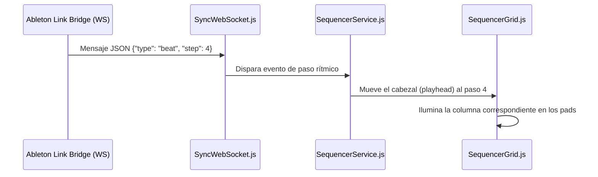

# Arquitectura Frontend: Domain-Driven Design (DDD)

Este documento detalla la estructura y el flujo de diseño guiado por el dominio (DDD) utilizado para organizar la interfaz web de la estación algorítmica TR-808 (**BAZZ**). 

Al separar la lógica en capas desacopladas, se logra que el código de la interfaz sea modular, fácil de mantener y ampliable para futuros sintetizadores o parámetros sin alterar la UI original.

---

## 🏗️ Capas de la Arquitectura

La carpeta `web/src/` está estructurada en 4 capas principales:

```
web/src/
├── domain/            <-- Capa de Dominio (Modelos de negocio y lógica pura)
├── application/       <-- Capa de Aplicación (Orquestación, timers y automatización)
├── infrastructure/    <-- Capa de Infraestructura (Llamadas API, WebSockets, LocalStorage)
└── presentation/      <-- Capa de Presentación (Componentes visuales y controladores de eventos)
```

---

### 1. Capa de Dominio (`src/domain/`)
Contiene los modelos y reglas de negocio del sintetizador. No tiene ninguna relación con el DOM o librerías visuales, asegurando que las reglas del instrumento sean 100% testeables en aislamiento.

*   `Parameter.js`: Define el objeto `Parameter` con propiedades Faust (ruta de API, valor, rango mínimo/máximo original y efectivo, etiquetas). Contiene lógica de conversión de rangos de visualización.
*   `Sequencer.js`: Define el estado del secuenciador de 16 pasos por instrumento (bombo, caja, platillos, etc.) y la posición del cabezal de reproducción.
*   `Performance.js`: Representa una performance de automatización mediante fotogramas clave (*keyframes*), duraciones y transiciones de interpolación.
*   `Groove.js`: Almacena y manipula patrones rítmicos precargados o personalizados.

---

### 2. Capa de Aplicación (`src/application/`)
Coordina y orquesta los casos de uso del sistema. Une la capa de dominio con la infraestructura y notifica a la presentación cuando el estado del sistema cambia.

*   `StateManager.js`: Orquestador central de la aplicación. Mantiene el caché de parámetros locales, despacha actualizaciones, realiza consultas al backend cada intervalo y maneja las estadísticas del HUD (BPM, CPU, RAM).
*   `SequencerService.js`: Controla las funciones de reproducción/parada, inicializa los estados de pasos en el backend, calcula el *groove* actual, y maneja la aleatorización y limpieza de pasos.
*   `PerformerService.js`: Controla la máquina de estados de la automatización en el tiempo, interpolando valores entre fotogramas clave y aplicándolos al sintetizador.

---

### 3. Capa de Infraestructura (`src/infrastructure/`)
Implementa los adaptadores que permiten al sistema comunicarse con el mundo exterior (APIs HTTP, puertos de red, bases de datos locales).

*   `ApiClient.js`: Encapsula todas las peticiones `fetch` HTTP a los endpoints `/api/params`, `/api/set`, `/api/status`, etc. expuestos por el ejecutable C++ (`bazz.exe`).
*   `SyncWebSocket.js`: Administra la conexión a `ws://127.0.0.1:8002` (Ableton Link Bridge) para escuchar pulsos de reloj externos en tiempo real.
*   `LocalStorageRepo.js`: Persistencia de respaldo en el navegador del usuario para los mapeos personalizados (`paramMappings`), presets y grooves en caso de desconexión del servidor.

---

### 4. Capa de Presentación (`src/presentation/`)
Traduce las interacciones del usuario en comandos de aplicación y dibuja el estado en la pantalla usando HTML y CSS.

#### Componentes (`src/presentation/components/`)
*   `MixerConsole.js`: Dibuja y actualiza la consola de mezcla (6 canales), los controles de fader vertical, panning horizontal, y selectores locales de groove.
*   `SequencerGrid.js`: Renderiza la matriz de pads de secuenciador (16 pasos por instrumento), colorea el cabezal de reproducción (*playhead*) dinámicamente y expone los selectores del panel.
*   `InstrumentPanel.js`: Renderiza la sección activa de controles avanzados para el instrumento seleccionado (bombo, caja, platillos, bajo, psycho, siringe).
*   `LcdTelemetry.js`: Dibuja la barra de estado superior, incluyendo el display digital de BPM, medidores dB Master y luces LED indicadoras (OSC, MIDI, Link).
*   `PerformerUi.js`: Maneja el panel lateral izquierdo que controla el JSON de la performance activa, botón de inicio, parada y selector de presets.
*   `MappingModal.js`: Renderiza y controla el modal flotante que permite al usuario definir límites mínimo y máximo para cualquier fader.

#### Controladores de Interacción (`src/presentation/handlers/`)
*   `KnobDragHandler.js`: Maneja el arrastre del ratón o pantalla táctil sobre los potenciómetros visuales (knobs), calculando el delta de movimiento y actualizando la interfaz SVG.

---

## 🔄 Flujo de Datos (Data Flow)

Cuando el usuario interactúa con la interfaz (por ejemplo, al girar un potenciómetro):

```mermaid
sequenceDiagram
    actor Usuario
    participant Presentation as KnobDragHandler.js
    participant AppState as StateManager.js
    participant API as ApiClient.js
    participant C++ Server as OscServer (C++)

    Usuario->>Presentation: Arrastra el potenciómetro
    Presentation->>Presentation: Calcula nuevo valor relativo
    Presentation->>AppState: Actualiza parámetro (ruta, valor)
    AppState->>API: Enviar comando de set (/api/set)
    API->>C++ Server: HTTP GET /api/set?path=/kick/vol&value=0.75
    C++ Server->>AppState: Respuesta HTTP OK
    AppState->>Presentation: Confirma valor y actualiza la UI visual
```

De igual forma, cuando llega un mensaje de sincronización por red:


